# LAMP Stack Implementation on AWS EC2

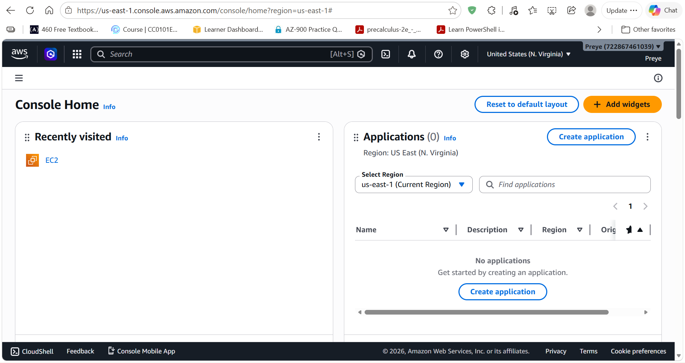

## Step 0: What is a LAMP Stack?

The **LAMP stack** is a popular open-source web development platform. It consists of four main components:

- **L**inux – The operating system
- **A**pache – The web server
- **M**ySQL – The relational database management system
- **P**HP – The server-side scripting language

Together, these components allow you to build and host dynamic websites and web applications.

### My Environment

- **Local Machine**: Windows 11 with **WSL (Windows Subsystem for Linux)** + Ubuntu terminal
- **Cloud**: AWS EC2 (Ubuntu Server 24.04 LTS)
- **Instance Type**: t3.micro (Free Tier)

I used WSL because I don't have a native Linux laptop. All commands were executed from the Ubuntu terminal in WSL.

---

## Step 1: Launching the EC2 Instance

1. Logged into the AWS Management Console → navigated to **EC2**.
2. Clicked **Launch instance**.
3. Configured the instance:
   - **Name**: `LAMP`
   - **Software Image (AMI)**: Ubuntu Server 24.04 LTS

     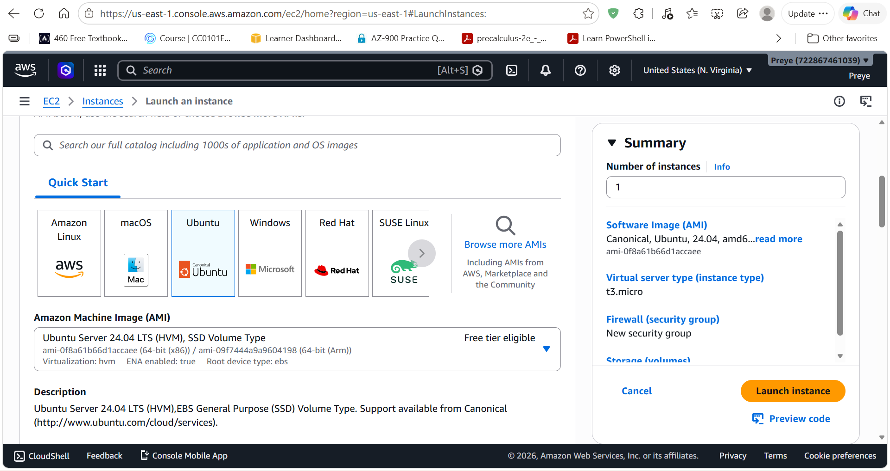

   - **Instance Type**: `t3.micro`
   - **Key Pair**: Created `LAMP.pem`
   - **Security Group**: Opened ports 22 (SSH) and 80 (HTTP)

     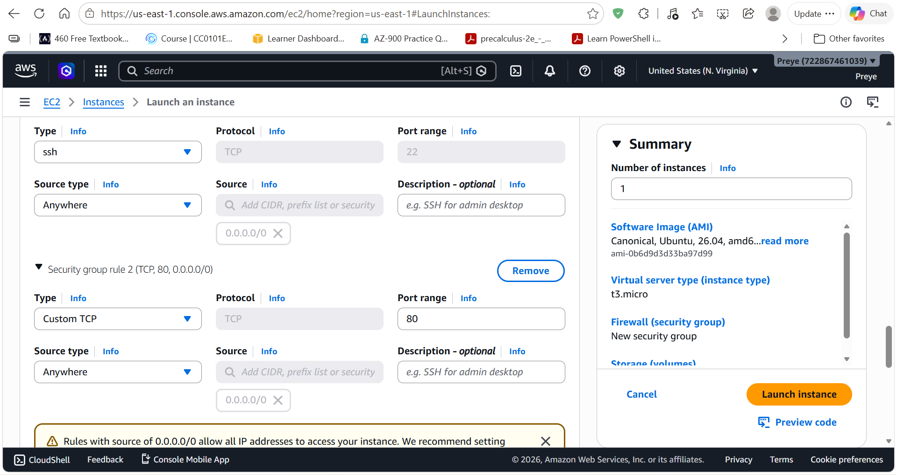

4. Launched the instance.

   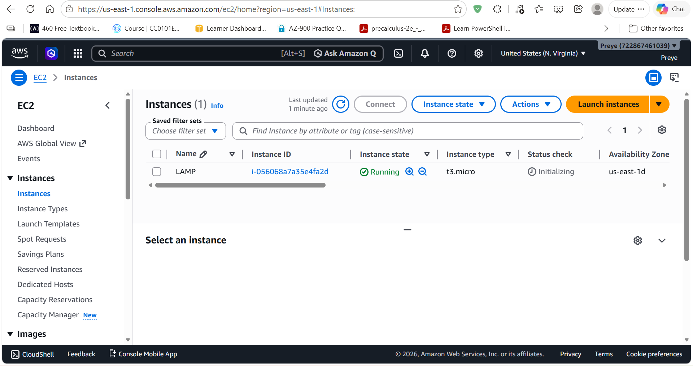

---

## Step 2: Connecting to EC2 from WSL

1. Downloaded the `.pem` key and moved it to my WSL Ubuntu home directory.
2. Copied the public IP address of the EC2 instance and attempted to connect via SSH — but got a permissions error:

   ```bash
   ssh -i LAMP.pem ubuntu@54.175.226.119
   ```

   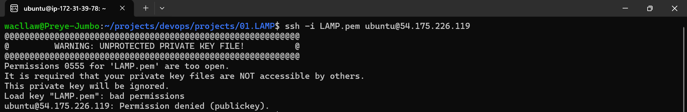

3. Set the correct key permissions and reconnected:

   ```bash
   chmod 400 LAMP.pem
   ssh -i LAMP.pem ubuntu@54.175.226.119
   ```

   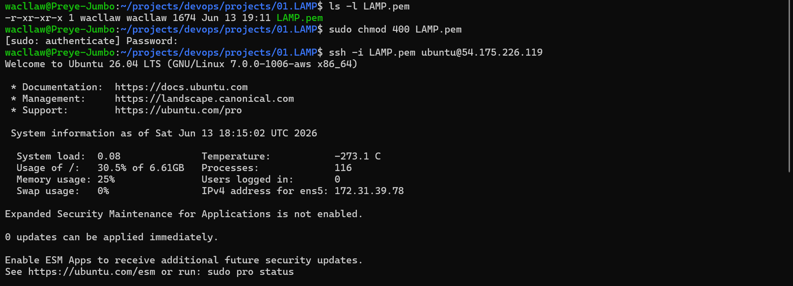

---

## Step 3: Updating System Packages

Updated the system packages on the instance:

```bash
sudo apt update -y && sudo apt upgrade -y
```

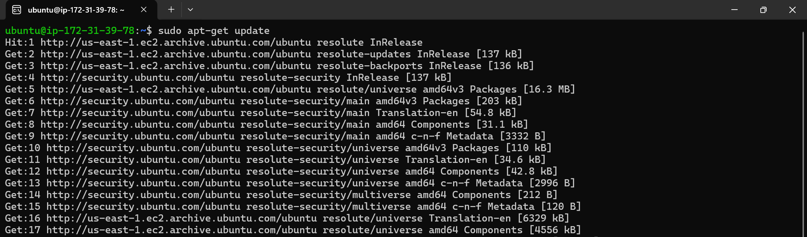

---

## Step 4: Installing Apache

```bash
sudo apt install apache2 -y
sudo systemctl start apache2
sudo systemctl enable apache2
sudo systemctl status apache2
```

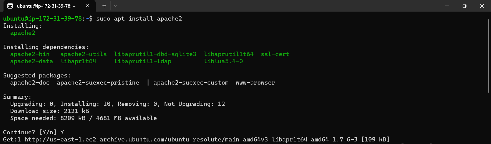
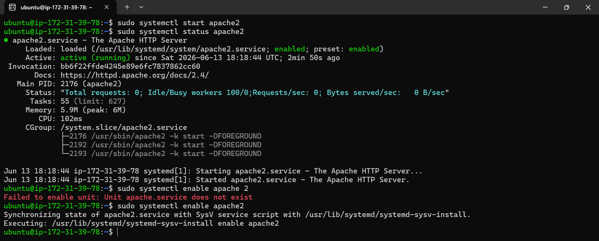

Tested by visiting `http://<ip-address>` → the default Apache page appeared.

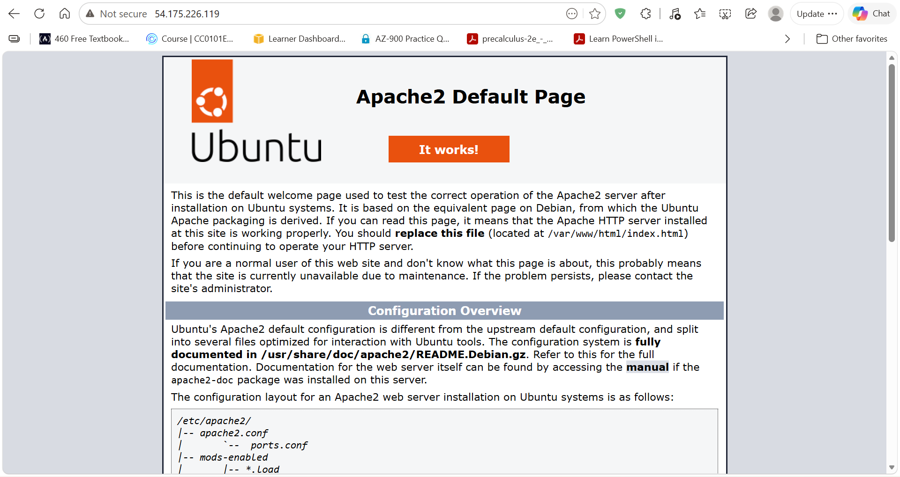

---

## Step 5: Installing MySQL

1. Install the MySQL server:

   ```bash
   sudo apt install mysql-server
   ```

   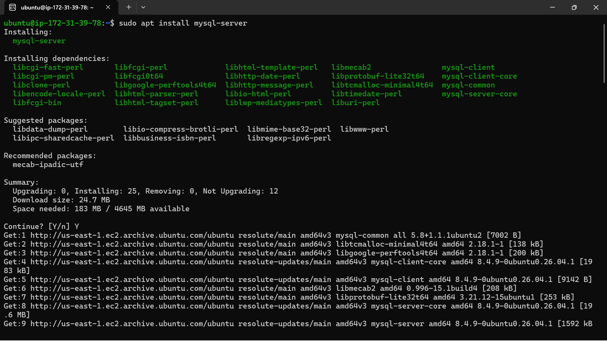

2. Start and enable the service:

   ```bash
   sudo systemctl start mysql
   sudo systemctl enable mysql
   ```

3. Check the service status:

   ```bash
   sudo systemctl status mysql
   ```

   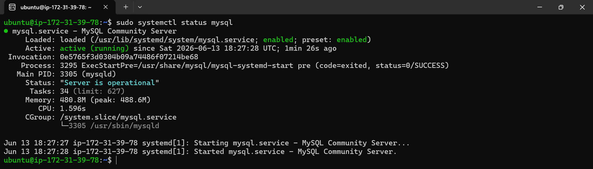

4. Run the secure installation script:

   ```bash
   sudo mysql_secure_installation
   ```

   - Set a strong password validation policy
   - Set a strong root password
   - Removed anonymous users

   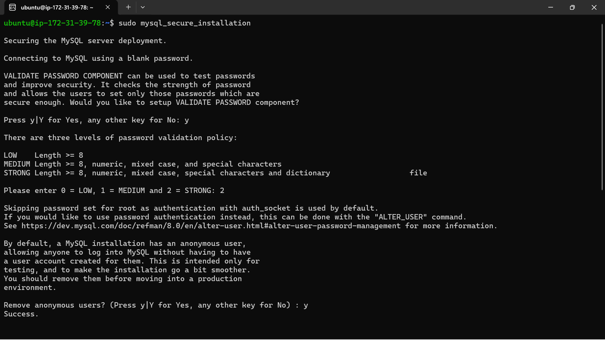

5. Tested login:

   ```bash
   mysql -u root -p
   ```

---

## Step 6: Installing PHP

1. Install PHP and required modules:

   ```bash
   sudo apt install php libapache2-mod-php php-mysql
   php -v
   ```

   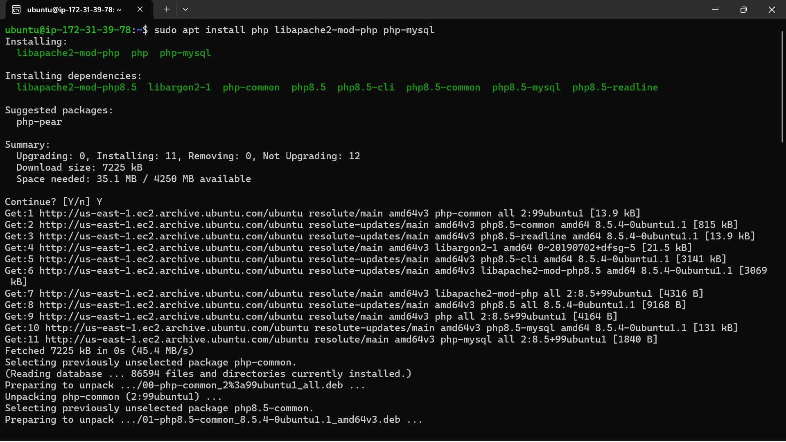
   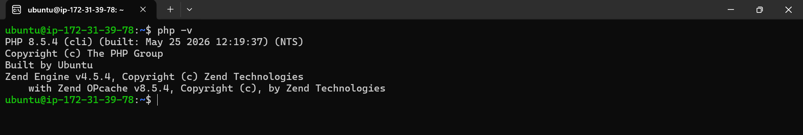

2. Create the project directory:

   ```bash
   sudo mkdir /var/www/html/projectlamp
   cd /var/www/html/projectlamp
   ```

3. Create a test PHP file:

   ```bash
   sudo nano info.php
   ```

   With the following content:

   ```php
   <?php
   phpinfo();
   ?>
   ```

   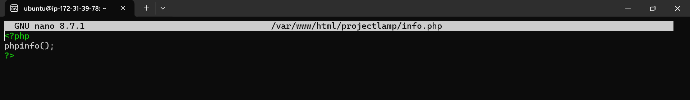

4. Create the virtual host configuration file:

   ```bash
   sudo nano /etc/apache2/sites-available/projectlamp.conf
   ```

   With the following content:

   ```apache
   <VirtualHost *:80>
       ServerName projectlamp
       ServerAlias www.projectlamp
       ServerAdmin webmaster@localhost
       DocumentRoot /var/www/html/projectlamp
       ErrorLog ${APACHE_LOG_DIR}/error.log
       CustomLog ${APACHE_LOG_DIR}/access.log combined
   </VirtualHost>
   ```

5. Enable the site:

   ```bash
   sudo a2ensite projectlamp.conf
   sudo systemctl reload apache2
   ```

   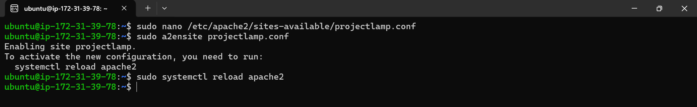

---

## Step 7: Testing the LAMP Stack

Visited `http://<ip-address>/info.php`:

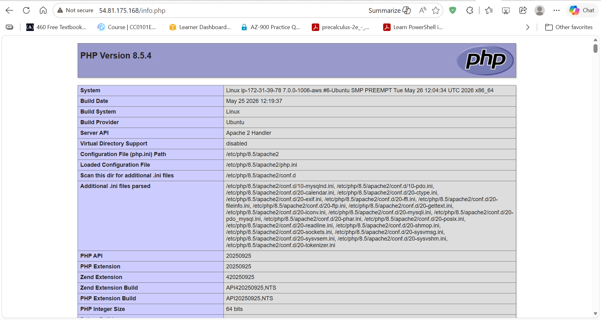

---

## Challenges and Solutions

| Issue | Solution |
|---|---|
| SSH permission denied | Fixed with `chmod 400 LAMP.pem` |
| MySQL password issues | Used `ALTER USER ... WITH mysql_native_password` |
| "Not Found" error | Disabled default site (`000-default.conf`) and enabled custom virtual host |
| Authentication required on `systemctl` | Used `sudo` |

---

## Conclusion

Successfully deployed a fully functional LAMP stack on AWS EC2 using Ubuntu 24.04.

### Skills Demonstrated

1. AWS EC2 instance provisioning
2. Linux server administration
3. LAMP stack configuration
4. Virtual host setup
5. Troubleshooting & documentation
