# Implementing a LEMP Stack on AWS EC2

## 1. Overview

LEMP is a technology stack used for hosting and deploying dynamic websites and web applications. It is made up of four components:

| Component | Role |
|---|---|
| **L**inux | Provides a stable and secure operating system |
| **E**Nginx (pronounced "Engine-X") | High-performance web server capable of handling many simultaneous connections |
| **M**ySQL | Relational database management system used for data storage and retrieval |
| **P**HP | Server-side scripting language used to create dynamic web pages |

Together, these four components work hand-in-hand to create a robust hosting environment for web applications.

This document walks through implementing the LEMP stack on an **AWS EC2 instance**.

---

## 2. Prerequisites

- An AWS account
- Basic familiarity with the Linux terminal
- An SSH client (Terminal, Git Bash, PowerShell, etc.)
- A downloaded key pair (`.pem` file) for SSH access

---

## 3. Setting Up the AWS Environment

### 3.1 Launch an EC2 Instance

1. Log in to the **AWS Management Console**.
2. Navigate to the **EC2 Dashboard**.
3. Click **Launch Instance**.
4. Give the instance a name (e.g. `lemp-server`).
5. Choose the **Ubuntu** Amazon Machine Image (AMI) for stability.
6. Select **t3.micro** as the instance type (Free Tier eligible).
7. Configure the key pair:
   - Create a new key pair, **or**
   - Select an existing key pair.
8. Configure the **Security Group**:
   - Allow **port 22** (SSH access from your terminal)
   - Allow **port 80** (HTTP access from the internet)
9. Leave storage at the default Free Tier setting (or configure as needed).
10. Review the configuration summary, then click **Launch Instance**.
11. Wait for the instance to initialize until its status shows **Running**.

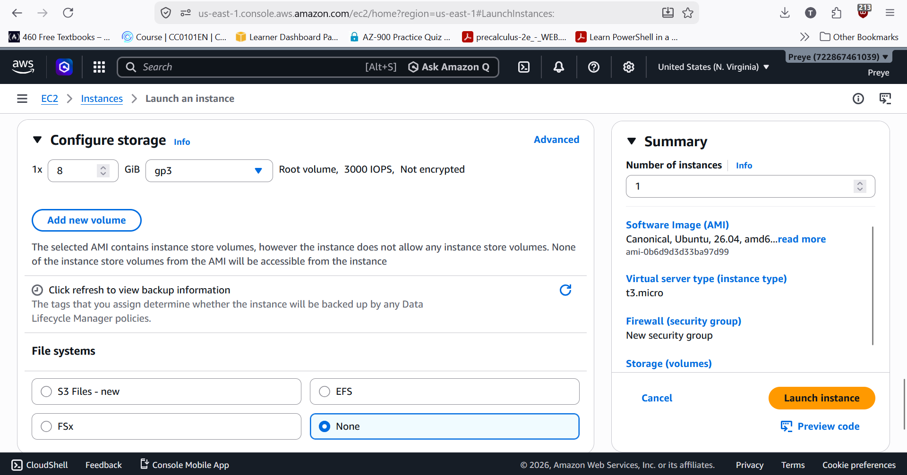
>
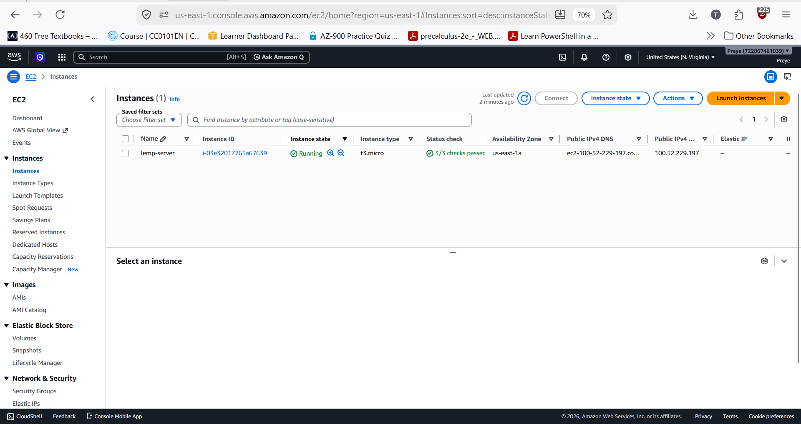

### 3.2 Connect to the Instance via SSH

1. Copy the **Public IP address** of the instance from the EC2 console.
2. In your terminal, run:

   ```bash
   chmod 400 LEMP.pem
   ssh -i LEMP.pem ubuntu@100.52.229.197
   ```

   - `chmod 400` sets the right permissions
   - `ssh` initiates the secure connection.
   - `-i` specifies the private key file used for authentication.
   - `ubuntu` is the default username for Ubuntu AMIs.

4. If successful, you should be logged into the remote server as the `ubuntu` user.

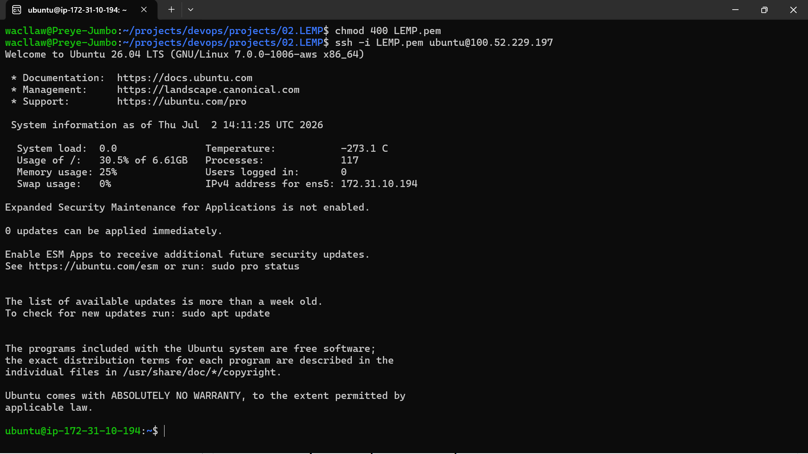

---

## 4. Installing NGINX (Web Server)

### 4.1 Update Package Index

```bash
sudo apt update -y && sudo apt upgrade -y
```
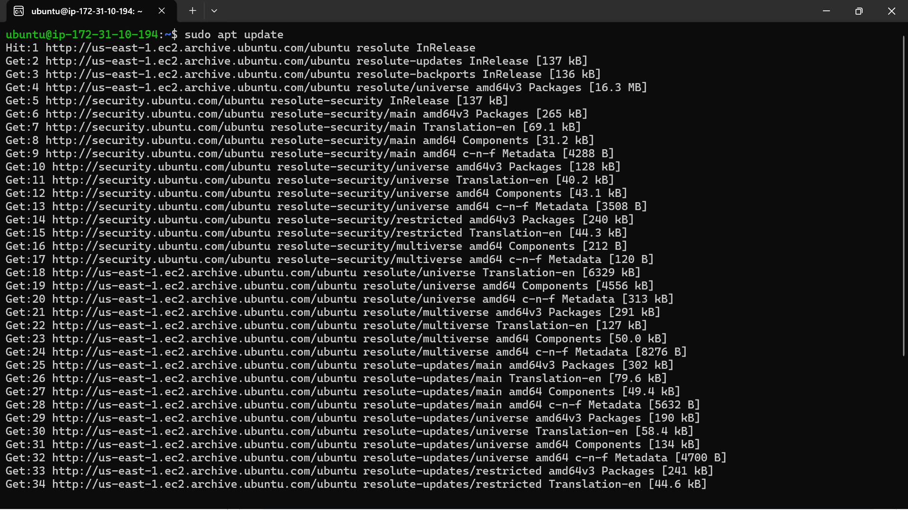
- Reboot the instance for the upgrades to take effect

### 4.2 Install NGINX

```bash
sudo apt install nginx -y
```
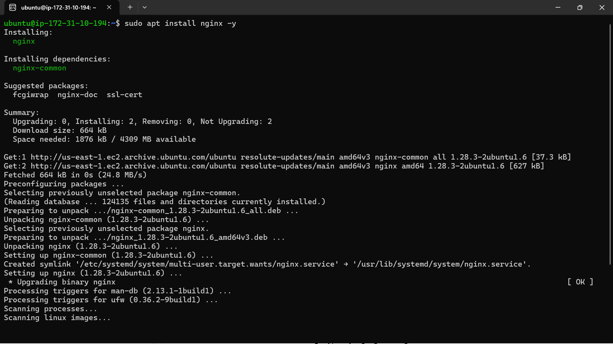

### 4.3 Verify NGINX Is Running

```bash
sudo systemctl status nginx
```
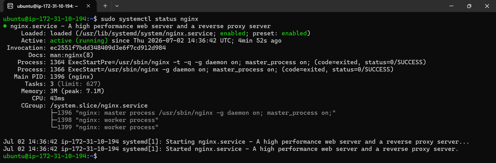

You can see a status of **active (running)**, highlighted in green.


### 4.4 Verify Web Server Accessibility

**Option A — via terminal (curl):**

```bash
curl http://100.52.229.197
```
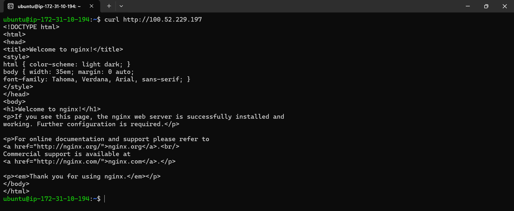

**Option B — via browser:**

Navigate to `http://100.52.229.197` in your browser. You should see the default **"Welcome to nginx!"** page.
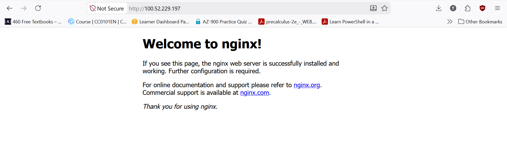

---

## 5. Installing MySQL (Database)

### 5.1 Install MySQL Server and Verify That It's Running

```bash
sudo apt install mysql-server -y
sudo systemctl status mysql
```
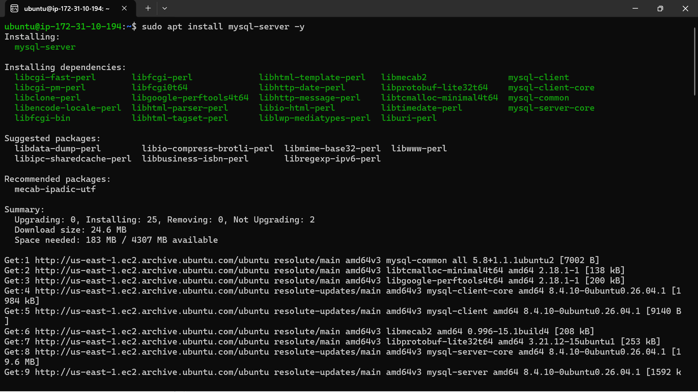
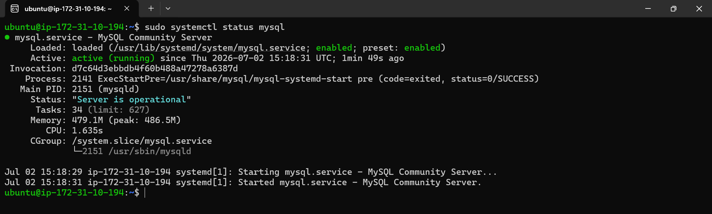

### 5.2 Secure the MySQL Installation

```bash
sudo mysql_secure_installation
```

Follow the prompts to:
- Enable the password validation policy (recommended: select a strong password level)
- Set a root password
- Remove anonymous users
- Disallow remote root login
- Remove the test database
- Reload privilege tables
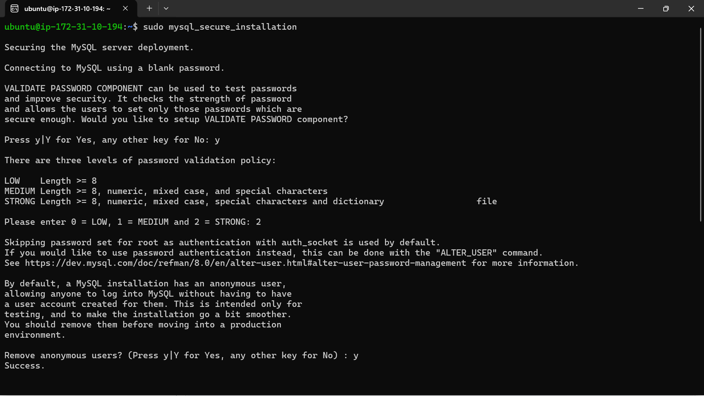
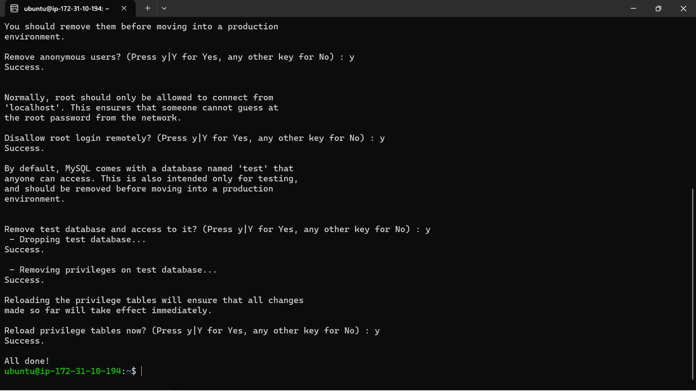

### 5.3 Create a Database and User

Log in to the MySQL console as root:

```bash
sudo mysql
```

Inside the MySQL console, run:

```sql
CREATE DATABASE testdb;

CREATE USER 'test'@'localhost' IDENTIFIED BY 'Test123$';

GRANT ALL PRIVILEGES ON testdb.* TO 'test'@'localhost';

FLUSH PRIVILEGES;

EXIT;
```

> **Note:** `GRANT ALL PRIVILEGES` gives the specified user full control (create, read, update, delete) over the specified database. `FLUSH PRIVILEGES` reloads the grant tables so that MySQL immediately recognizes the new permissions — it does **not** delete or clear any data.
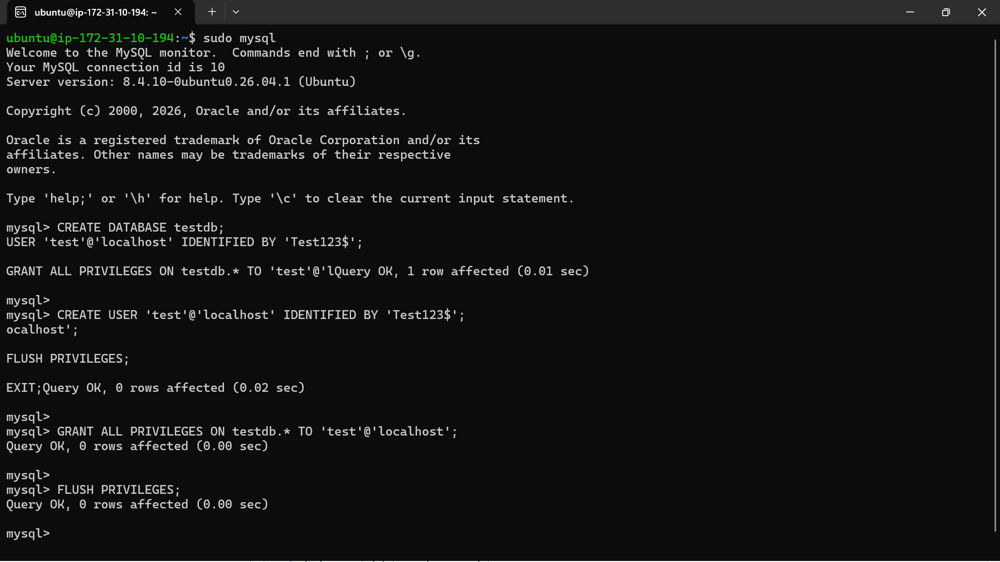

### 5.4 Verify Access with the New User

```bash
mysql -u test -p
```

Enter the password you created above. Once inside, confirm the database exists:

```sql
SHOW DATABASES;
```

You should see `testdb` listed.

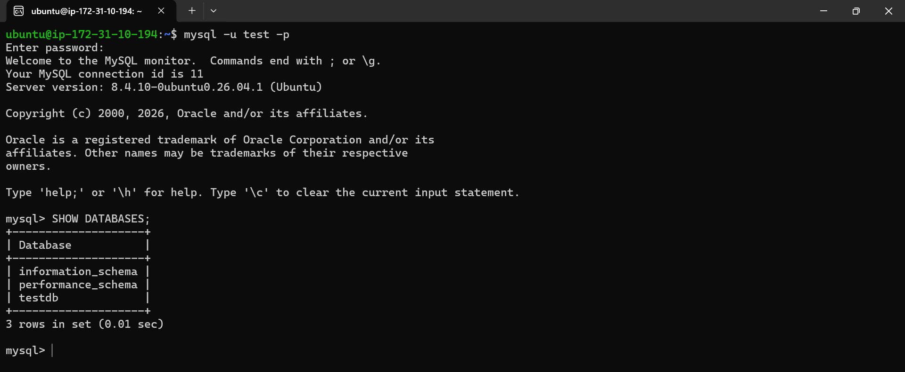

---

## 6. Installing PHP

### 6.1 Install PHP and Required Extensions

```bash
sudo apt install php-fpm php-mysql -y
```

- **php-fpm** — FastCGI Process Manager; allows NGINX to process PHP requests.
- **php-mysql** — extension enabling PHP to communicate with MySQL.
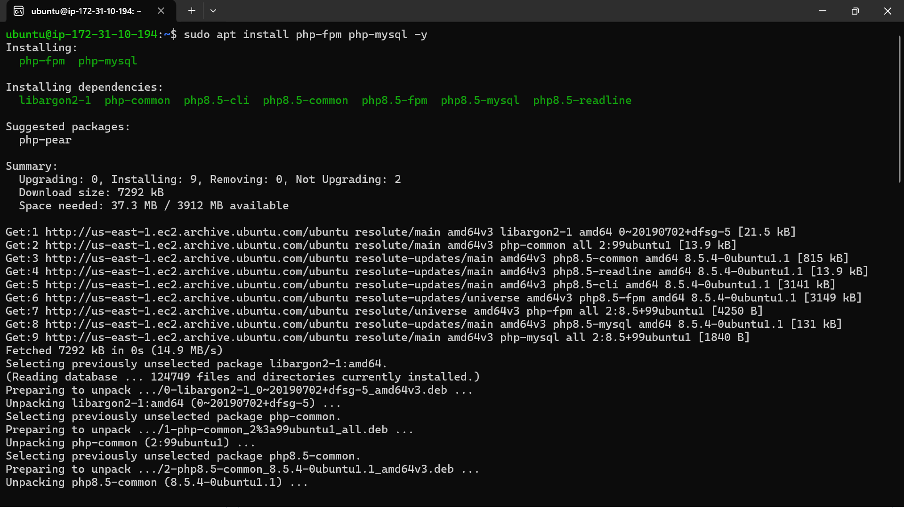

### 6.2 Verify the PHP Version

```bash
php -v
```

Expected output: PHP version (e.g. `PHP 8.3`).
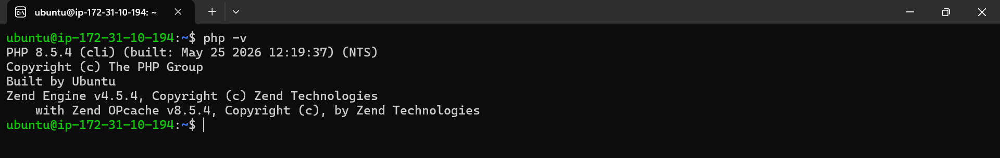

---

## 7. Configuring NGINX to Work with PHP

### 7.1 Create the Website Root Directory

```bash
sudo mkdir /var/www/projectLEMP
```

Confirm the directory was created:

```bash
ls /var/www/
```
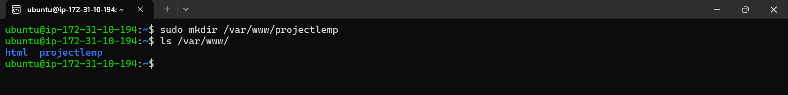

### 7.2 Assign Ownership to the Current User

```bash
sudo chown -R $USER:$USER /var/www/projectLEMP
```

`$USER` is an environment variable referring to the currently logged-in user.

### 7.3 Create an NGINX Server Block Configuration

```bash
sudo nano /etc/nginx/sites-available/projectLEMP
```

Paste in the following configuration block (adjust `server_name` and paths as needed):

```nginx
server {
    listen 80;
    server_name projectLEMP www.projectLEMP;
    root /var/www/projectLEMP;

    index index.html index.htm index.php;

    location / {
        try_files $uri $uri/ =404;
    }

    location ~ \.php$ {
        include snippets/fastcgi-php.conf;
        fastcgi_pass unix:/var/run/php/php8.3-fpm.sock;
    }

    location ~ /\.ht {
        deny all;
    }
}
```

**Directive breakdown:**

| Directive | Purpose |
|---|---|
| `listen 80` | Port NGINX listens on (default HTTP port, opened in the security group) |
| `root` | Document root — where website files are stored |
| `index` | Order of priority for index files (`.html` → `.htm` → `.php`) |
| `location /` | Handles requests to the root URL; checks for file existence |
| `location ~ \.php$` | Routes PHP file requests to the PHP-FPM socket for processing |
| `location ~ /\.ht` | Denies access to `.htaccess` files, which NGINX does not process |

Save and exit (Ctrl+O, Enter, then Ctrl+X in `nano`).

> 📸 _Screenshot: NGINX server block configuration file contents_

### 7.4 Enable the Configuration

```bash
sudo ln -s /etc/nginx/sites-available/projectLEMP /etc/nginx/sites-enabled/
```

### 7.5 Test for Syntax Errors

```bash
sudo nginx -t
```

You should see a message confirming the syntax is OK and the test was successful.

> 📸 _Screenshot: `nginx -t` success output_

### 7.6 Disable the Default NGINX Site

```bash
sudo unlink /etc/nginx/sites-enabled/default
```

### 7.7 Reload NGINX

```bash
sudo systemctl reload nginx
```

---

## 8. Testing the Full LEMP Setup

### 8.1 Create a PHP Info File

```bash
cd /var/www/projectLEMP
sudo nano index.php
```

Add the following content:

```php
<?php
phpinfo();
```

Save and exit.

### 8.2 Verify in the Browser

Navigate to:

```
http://<public-ip-address>
```

You should see the default **PHP Info** page, displaying details about your PHP configuration and version.

> 📸 _Screenshot: PHP Info page displayed in browser_

---

## 9. Summary

In this implementation, the following was accomplished:

- Provisioned and configured an AWS EC2 instance (Ubuntu, t2.micro)
- Connected to the instance securely via SSH
- Installed and verified **NGINX** as the web server
- Installed and secured **MySQL**, and created a database and user
- Installed **PHP** and its required extensions
- Configured NGINX to process PHP requests via a custom server block
- Verified the complete stack using a PHP info page

This confirms a fully functional **LEMP stack** (Linux, NGINX, MySQL, PHP) running on AWS EC2, ready to host dynamic web applications.

---

## 10. Notes / Troubleshooting

- If `nginx -t` reports errors, revisit the server block configuration for typos, especially in the `fastcgi_pass` socket path (must match your installed PHP version, e.g. `php8.3-fpm.sock`).
- If the instance is stopped/restarted, note that the **Public IP** may change (unless an Elastic IP is assigned), while the **Private IP** typically remains the same.
- To avoid ongoing AWS charges, terminate the instance once the project has been submitted and assessed, unless it's needed for a dependent follow-up project.
