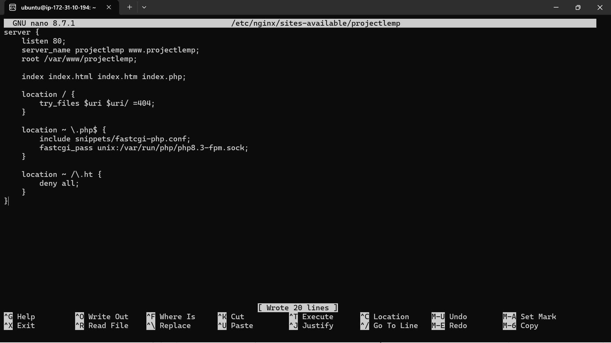
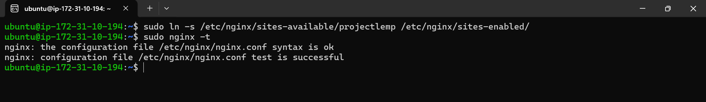
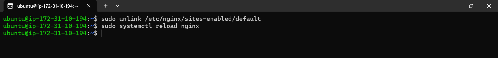
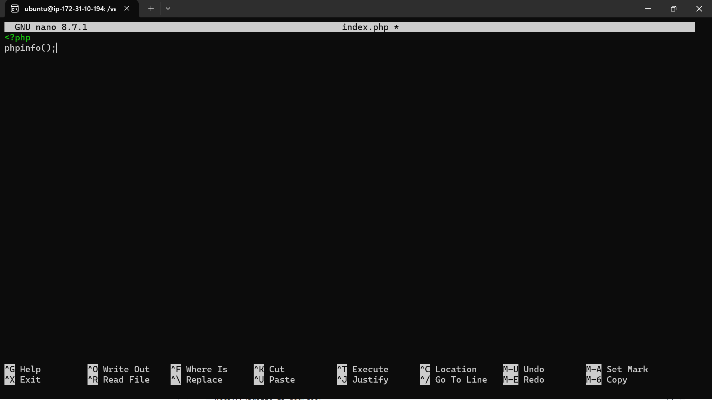
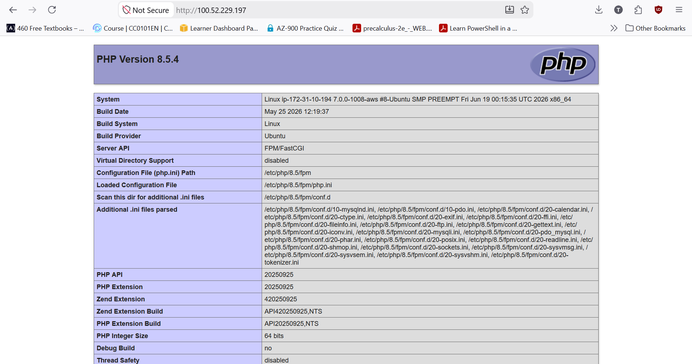
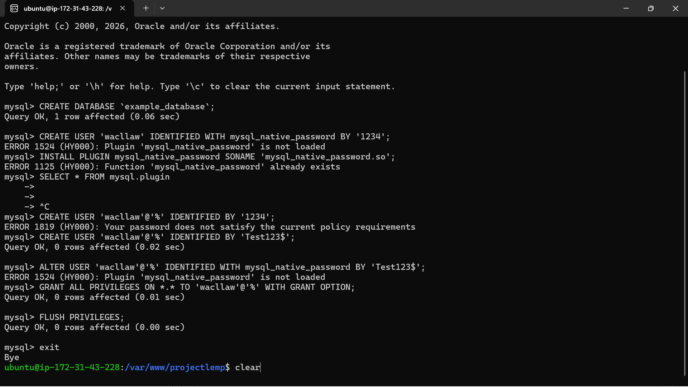
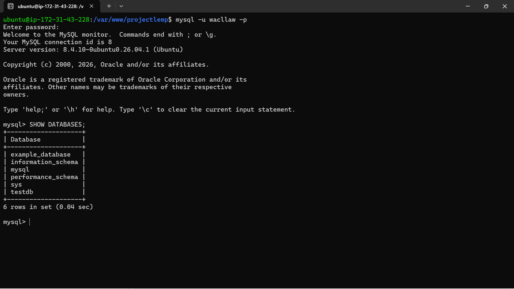
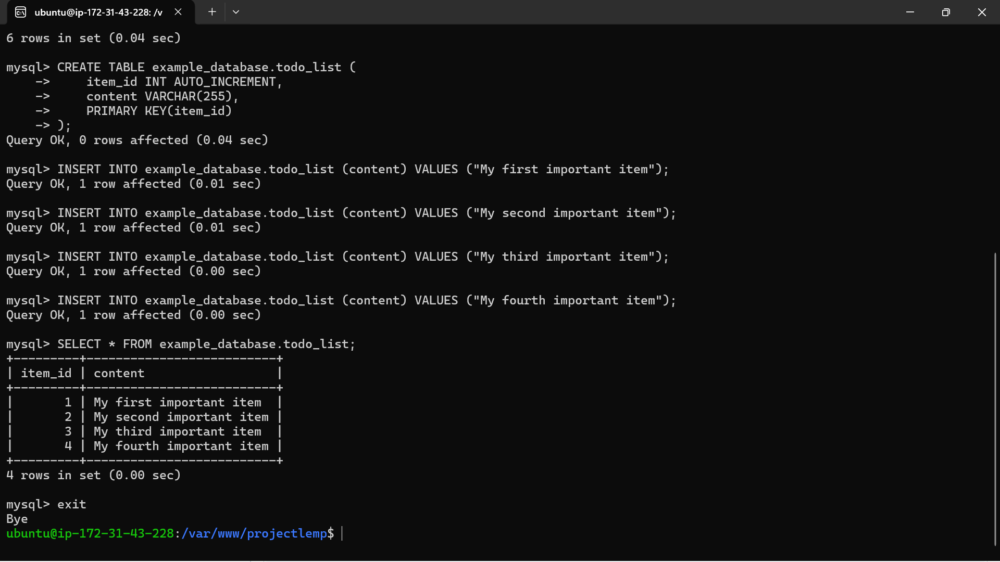
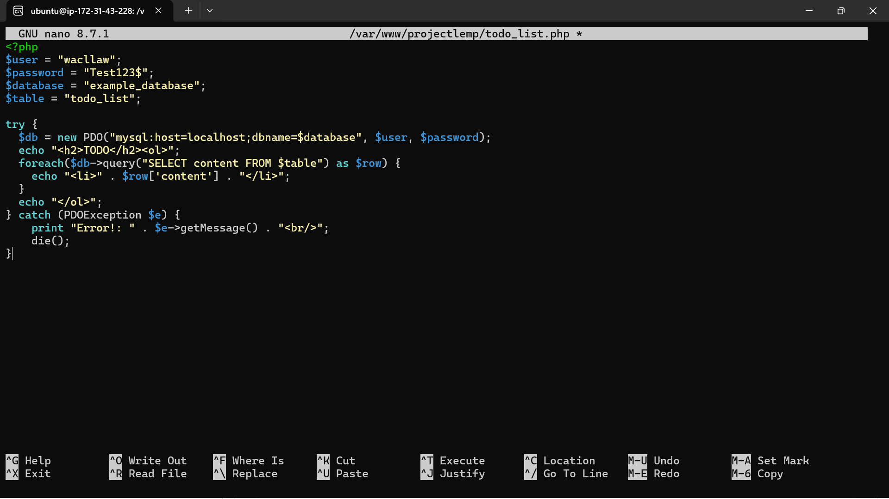
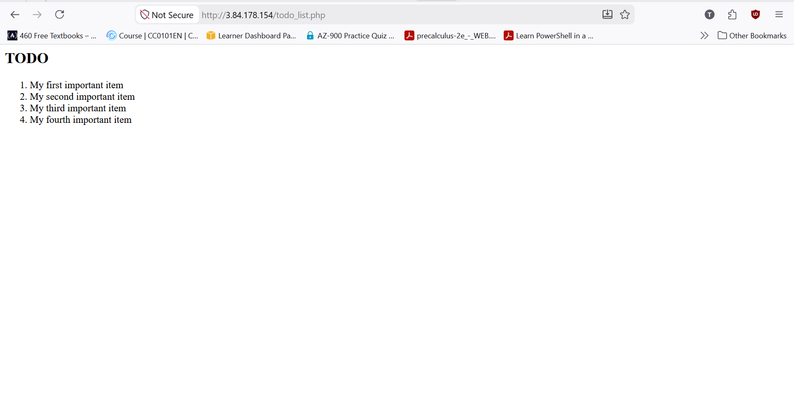

# Implementing a LEMP Stack on AWS EC2

## 1. Overview

For this project, I implemented a LEMP stack on an AWS EC2 instance. LEMP is a technology stack used for hosting and deploying dynamic websites and web applications, made up of four components:

| Component | Role |
|---|---|
| **L**inux | Provides a stable and secure operating system |
| **E**Nginx (pronounced "Engine-X") | High-performance web server capable of handling many simultaneous connections |
| **M**ySQL | Relational database management system used for data storage and retrieval |
| **P**HP | Server-side scripting language used to create dynamic web pages |

Together, these four components work hand-in-hand to create a robust hosting environment for web applications. In this document, I walk through how I set up and configured each component on an EC2 instance, tested the stack end-to-end, and resolved two real issues I ran into along the way.

---

## 2. Prerequisites

- An AWS account
- Basic familiarity with the Linux terminal
- An SSH client (Terminal, Git Bash, PowerShell, etc.)
- A downloaded key pair (`.pem` file) for SSH access

---

## 3. Setting Up the AWS Environment

### 3.1 Launch an EC2 Instance

1. Log in to the **AWS Management Console**.
2. Navigate to the **EC2 Dashboard**.
3. Click **Launch Instance**.
4. Give your instance a name (e.g. `lemp-server`).
5. Choose the **Ubuntu** Amazon Machine Image (AMI) for stability.
6. Select **t3.micro** as the instance type (Free Tier eligible).
7. Configure the key pair:
   - Create a new key pair, **or**
   - Select an existing key pair.
8. Configure the **Security Group**:
   - Allow **port 22** (SSH access from your terminal)
   - Allow **port 80** (HTTP access from the internet)
9. Leave storage at the default Free Tier setting (or configure as needed).
10. Review the configuration summary, then click **Launch Instance**.
11. Wait for your instance to initialize until its status shows **Running**.


>


### 3.2 Connect to the Instance via SSH

1. Copy the **Public IP address** of your instance from the EC2 console.
2. In your terminal, run:

   ```bash
   chmod 400 LEMP.pem
   ssh -i LEMP.pem ubuntu@100.52.229.197
   ```

   - `chmod 400` sets the right permissions on your key file.
   - `ssh` initiates the secure connection.
   - `-i` specifies the private key file used for authentication.
   - `ubuntu` is the default username for Ubuntu AMIs.

3. If successful, you'll be logged into the remote server as the `ubuntu` user.


---

## 4. Installing NGINX (Web Server)

### 4.1 Update Package Index

Run:

```bash
sudo apt update -y && sudo apt upgrade -y
```


Reboot the instance for the upgrades to take effect.

### 4.2 Install NGINX

Run:

```bash
sudo apt install nginx -y
```


### 4.3 Verify NGINX Is Running

Run:

```bash
sudo systemctl status nginx
```


Look for a status of **active (running)**, highlighted in green.

### 4.4 Verify Web Server Accessibility

**Option A — via terminal (curl):**

Run:

```bash
curl http://100.52.229.197
```


**Option B — via browser:**

Navigate to `http://100.52.229.197` in your browser. You should see the default **"Welcome to nginx!"** page.


---

## 5. Installing MySQL (Database)

### 5.1 Install MySQL Server and Verify That It's Running

Run:

```bash
sudo apt install mysql-server -y
sudo systemctl status mysql
```


### 5.2 Secure the MySQL Installation

Run:

```bash
sudo mysql_secure_installation
```

Follow the prompts to:
- Enable the password validation policy (recommended: select a strong password level)
- Set a root password
- Remove anonymous users
- Disallow remote root login
- Remove the test database
- Reload privilege tables


### 5.3 Create a Database and User

Log in to the MySQL console as root:

```bash
sudo mysql
```

Inside the MySQL console, run:

```sql
CREATE DATABASE testdb;

CREATE USER 'test'@'localhost' IDENTIFIED BY 'Test123$';

GRANT ALL PRIVILEGES ON testdb.* TO 'test'@'localhost';

FLUSH PRIVILEGES;

EXIT;
```

> **Note:** `GRANT ALL PRIVILEGES` gives the specified user full control (create, read, update, delete) over the specified database. `FLUSH PRIVILEGES` reloads the grant tables so that MySQL immediately recognizes the new permissions — it does **not** delete or clear any data.


### 5.4 Verify Access with the New User

Run:

```bash
mysql -u test -p
```

Enter the password you created above. Once inside, confirm the database exists:

```sql
SHOW DATABASES;
```

You should see `testdb` listed.


---

## 6. Installing PHP

### 6.1 Install PHP and Required Extensions

Run:

```bash
sudo apt install php-fpm php-mysql -y
```

- **php-fpm** — FastCGI Process Manager; allows NGINX to process PHP requests.
- **php-mysql** — extension enabling PHP to communicate with MySQL.


### 6.2 Verify the PHP Version

Run:

```bash
php -v
```

You should see your installed PHP version (e.g. `PHP 8.5`).


---

## 7. Configuring NGINX to Work with PHP

### 7.1 Create the Website Root Directory

Run:

```bash
sudo mkdir /var/www/projectlemp
```

Confirm the directory was created:

```bash
ls /var/www/
```


### 7.2 Assign Ownership to Your Current User

Run:

```bash
sudo chown -R $USER:$USER /var/www/projectlemp
```

`$USER` is an environment variable referring to your currently logged-in user.

### 7.3 Create an NGINX Server Block Configuration

Open a new configuration file:

```bash
sudo nano /etc/nginx/sites-available/projectlemp
```

Paste in the following configuration block (adjust `server_name` and paths as needed):

```nginx
server {
    listen 80;
    server_name projectlemp www.projectlemp;
    root /var/www/projectlemp;

    index index.html index.htm index.php;

    location / {
        try_files $uri $uri/ =404;
    }

    location ~ \.php$ {
        include snippets/fastcgi-php.conf;
        fastcgi_pass unix:/var/run/php/php8.5-fpm.sock;
    }

    location ~ /\.ht {
        deny all;
    }
}
```

> **Important:** Make sure the `fastcgi_pass` socket path matches the PHP-FPM version actually installed on your server (confirm with `ls /var/run/php/`) rather than assuming a version number from a tutorial. See the troubleshooting note in Section 11.1 for a real example of what happens when these are mismatched.

**Directive breakdown:**

| Directive | Purpose |
|---|---|
| `listen 80` | Port NGINX listens on (default HTTP port, opened in the security group) |
| `root` | Document root — where website files are stored |
| `index` | Order of priority for index files (`.html` → `.htm` → `.php`) |
| `location /` | Handles requests to the root URL; checks for file existence |
| `location ~ \.php$` | Routes PHP file requests to the PHP-FPM socket for processing |
| `location ~ /\.ht` | Denies access to `.htaccess` files, which NGINX does not process |

Save and exit (Ctrl+O, Enter, then Ctrl+X in `nano`).



### 7.4 Enable the Configuration

Run:

```bash
sudo ln -s /etc/nginx/sites-available/projectlemp /etc/nginx/sites-enabled/
```

### 7.5 Test for Syntax Errors

Run:

```bash
sudo nginx -t
```

You should see a message confirming the syntax is OK and the test was successful.



### 7.6 Disable the Default NGINX Site

Run:

```bash
sudo unlink /etc/nginx/sites-enabled/default
```

### 7.7 Reload NGINX

Run:

```bash
sudo systemctl reload nginx
```


---

## 8. Testing the Full LEMP Setup

### 8.1 Create a PHP Info File

Change into your project directory and open a new file:

```bash
cd /var/www/projectlemp
sudo nano index.php
```

Add the following content:

```php
<?php
phpinfo();
```

Save and exit.



### 8.2 Verify in the Browser

Navigate to:

```
http://100.52.229.197
```

You should see the default **PHP Info** page, displaying details about your PHP configuration and version.



---

## 9. Retrieving Data from MySQL with PHP

In this step, create a test database with a simple "To-Do List" and query it through a PHP script, confirming that PHP can successfully connect to and retrieve data from MySQL.

> **Note:** The native MySQL PHP library (`mysqlnd`) does not support `caching_sha2_password`, which is the default authentication method in MySQL 8. To connect from PHP, you'll need to create a new user using the `mysql_native_password` authentication method instead (or the fallback shown in 9.2 if that plugin isn't available).

### 9.1 Create the Database

Log in to the MySQL console as root:

```bash
sudo mysql
```

Create a new database:

```sql
CREATE DATABASE `example_database`;
```

### 9.2 Create a User and Grant Privileges

> **Note:** The class material assumes `mysql_native_password` is available as an authentication plugin. On newer MySQL versions, this plugin may no longer be installed/available, causing a plugin error when attempting `IDENTIFIED WITH mysql_native_password`. If you hit this error, use the default authentication method instead, as shown below. See Section 11.2 for details on this issue.

Run:

```sql
-- 1. Create the user using the default authentication method (this works)
CREATE USER 'wacllaw'@'%' IDENTIFIED BY 'Test123$';

-- 2. Grant full privileges
GRANT ALL PRIVILEGES ON *.* TO 'wacllaw'@'%' WITH GRANT OPTION;

-- 3. Apply the changes
FLUSH PRIVILEGES;

-- 4. Exit
exit
```

> Replace `wacllaw` and `Test123$` with your own username and a secure password of your choosing. `WITH GRANT OPTION` additionally allows this user to grant privileges to other users — use with care outside of a learning/demo environment.



### 9.3 Verify the New User's Access

Log back in using the new user's credentials:

```bash
mysql -u wacllaw -p
```

Confirm access to the database:

```sql
SHOW DATABASES;
```

Expected output:

```
+--------------------+
| Database           |
+--------------------+
| example_database   |
| information_schema |
+--------------------+
2 rows in set (0.000 sec)
```



### 9.4 Create a Test Table

Run:

```sql
CREATE TABLE example_database.todo_list (
    item_id INT AUTO_INCREMENT,
    content VARCHAR(255),
    PRIMARY KEY(item_id)
);
```

### 9.5 Insert Sample Data

Run the following, repeating with different values as needed:

```sql
INSERT INTO example_database.todo_list (content) VALUES ("My first important item");
```

### 9.6 Confirm the Data Was Saved

Run:

```sql
SELECT * FROM example_database.todo_list;
```

Expected output:

```
+---------+--------------------------+
| item_id | content                  |
+---------+--------------------------+
|       1 | My first important item  |
|       2 | My second important item |
|       3 | My third important item  |
|       4 | and this one more thing  |
+---------+--------------------------+
4 rows in set (0.000 sec)
```

Exit the MySQL console:

```sql
exit
```



### 9.7 Create a PHP Script to Query the Database

Create a new PHP file in the web root directory:

```bash
sudo nano /var/www/projectlemp/todo_list.php
```

Add the following content:

```php
<?php
$user = "wacllaw";
$password = "Test123$";
$database = "example_database";
$table = "todo_list";

try {
  $db = new PDO("mysql:host=localhost;dbname=$database", $user, $password);
  echo "<h2>TODO</h2><ol>";
  foreach($db->query("SELECT content FROM $table") as $row) {
    echo "<li>" . $row['content'] . "</li>";
  }
  echo "</ol>";
} catch (PDOException $e) {
    print "Error!: " . $e->getMessage() . "<br/>";
    die();
}
```

Save and close the file.



### 9.8 Verify in the Browser

Navigate to:

```
http://ip-address/todo_list.php
```

You should see a rendered list showing the content you inserted into the `todo_list` table, confirming that PHP is correctly connecting to and querying MySQL.



---

## 10. Summary

By completing this project, I built a fully functional LEMP stack (Linux, NGINX, MySQL, PHP) on an AWS EC2 instance, ready to host dynamic web applications and interact with a database. Specifically, I:

- Provisioned and configured an AWS EC2 instance (Ubuntu, t3.micro)
- Connected to the instance securely via SSH
- Installed and verified **NGINX** as the web server
- Installed and secured **MySQL**, and created a database and user
- Installed **PHP** and its required extensions
- Configured NGINX to process PHP requests via a custom server block
- Verified the complete stack using a PHP info page
- Created a MySQL database, user, and test table
- Built a PHP script using PDO to query and display MySQL data in the browser

Along the way, I also diagnosed and resolved two real issues — a PHP-FPM socket mismatch causing a 502 error, and a missing `mysql_native_password` authentication plugin — both of which are documented in the troubleshooting section below.

---

## 11. Notes / Troubleshooting

- If `nginx -t` reports errors, revisit the server block configuration for typos, especially in the `fastcgi_pass` socket path (must match your installed PHP version, e.g. `php8.5-fpm.sock`).
- If your instance is stopped/restarted, note that the **Public IP** may change (unless an Elastic IP is assigned), while the **Private IP** typically remains the same.
- To avoid ongoing AWS charges, terminate the instance once the project has been submitted and assessed, unless it's needed for a dependent follow-up project.

### 11.1 Real Incident: 502 Bad Gateway (PHP-FPM Socket Mismatch)

**Symptom:** When I visited the site's public IP, nothing loaded, and `curl http://localhost` on the server returned:

```
502 Bad Gateway
nginx/1.28.3 (Ubuntu)
```

**Diagnosis steps:**

1. I confirmed NGINX itself was reachable locally (`curl http://localhost` returned a response, just a 502 — ruling out a security group/firewall issue).
2. I checked the PHP-FPM service referenced in my NGINX config:
   ```bash
   sudo systemctl status php8.3-fpm
   ```
   Result: `Unit php8.3-fpm.service could not be found.`
3. I checked the actual installed PHP version:
   ```bash
   php -v
   ```
   Result: `PHP 8.5.4`
4. I confirmed the actual running FPM service and socket:
   ```bash
   systemctl list-units --type=service | grep php
   ls /var/run/php/
   ```
   Result: `php8.5-fpm.service` was active, with socket `php8.5-fpm.sock` — not `php8.3-fpm.sock` as referenced in my NGINX config.

**Root cause:** My NGINX server block's `fastcgi_pass` directive was pointing to `php8.3-fpm.sock`, but the server had PHP 8.5 installed, whose FPM socket is `php8.5-fpm.sock`. NGINX couldn't find the backend socket to forward PHP requests to, resulting in a 502.

**Fix:** I opened the config file:

```bash
sudo nano /etc/nginx/sites-available/projectlemp
```

and updated the line:

```nginx
fastcgi_pass unix:/var/run/php/php8.3-fpm.sock;
```

to:

```nginx
fastcgi_pass unix:/var/run/php/php8.5-fpm.sock;
```

Then I tested and reloaded:

```bash
sudo nginx -t
sudo systemctl reload nginx
```

**Result:** `curl http://localhost` returned the expected page content instead of a 502, and the site loaded correctly via the public IP. This fix is already reflected in the server block shown in Section 7.3.

**Lesson:** Always confirm the actual installed PHP version and its corresponding FPM socket path (`ls /var/run/php/`) rather than assuming a version number from a tutorial — package managers may install a newer version than the one referenced in written instructions.

### 11.2 Real Incident: `mysql_native_password` Plugin Not Available

**Symptom:** When I ran the class-provided command to create a MySQL user:

```sql
CREATE USER 'example_user'@'%' IDENTIFIED WITH mysql_native_password BY 'PassWord.1';
```

MySQL returned a plugin-related error, indicating that `mysql_native_password` was not available/loaded as an authentication plugin.

**Root cause:** The class material assumes `mysql_native_password` is installed and usable by default, which was true on older MySQL 8.0 releases. On newer MySQL versions, this plugin may be disabled, removed, or not installed by default, since MySQL has been moving toward `caching_sha2_password` as the standard default authentication method.

**Fix:** I created the user with the server's default authentication method instead of explicitly specifying `mysql_native_password`, then granted privileges as needed:

```sql
-- 1. Create the user using the default authentication method (this works)
CREATE USER 'wacllaw'@'%' IDENTIFIED BY 'Test123$';

-- 2. Grant full privileges
GRANT ALL PRIVILEGES ON *.* TO 'wacllaw'@'%' WITH GRANT OPTION;

-- 3. Apply the changes
FLUSH PRIVILEGES;

-- 4. Exit
exit
```

**Result:** The user was created successfully and could authenticate from the PDO-based PHP script in Section 9.7 without any plugin errors.

**Lesson:** Tutorial steps that hardcode a specific authentication plugin can break on newer database versions where that plugin isn't available. When this happens, falling back to the server's default authentication method (omitting `IDENTIFIED WITH <plugin>`) is a reliable workaround for development/learning environments. In a production environment, it's worth checking which authentication plugins are actually available (`SHOW PLUGINS;`) and scoping privileges more narrowly than `ON *.*` before granting broad access.
