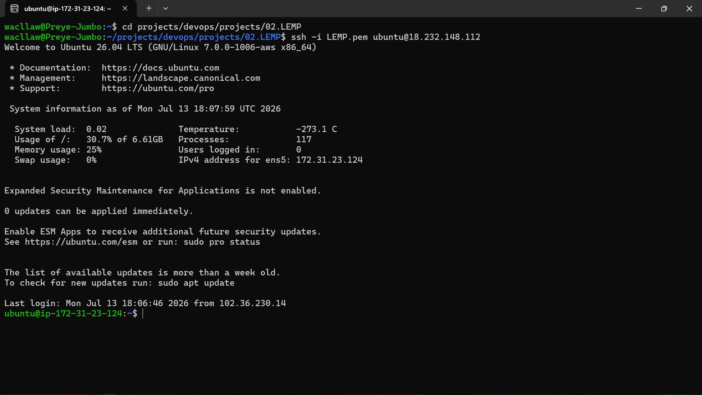
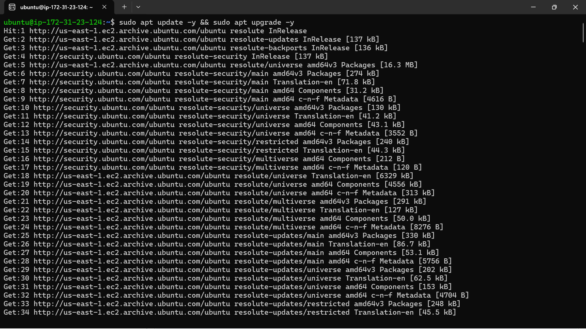
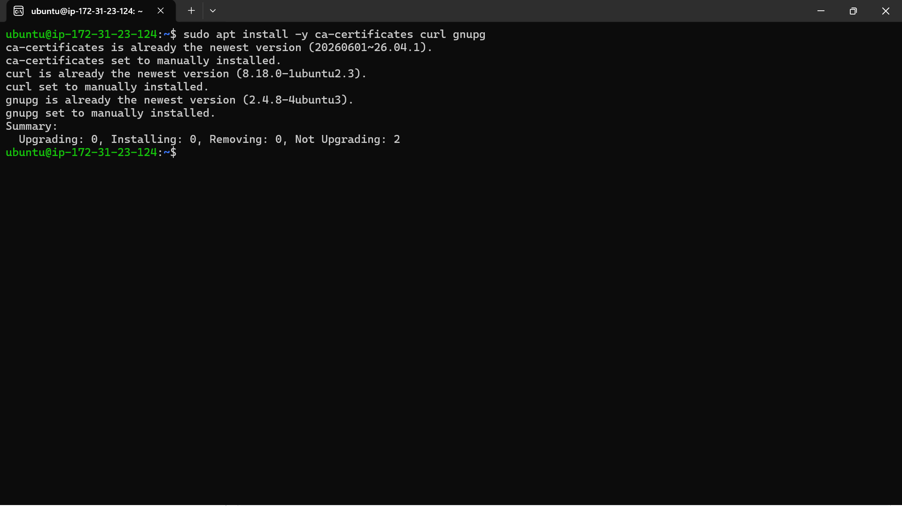
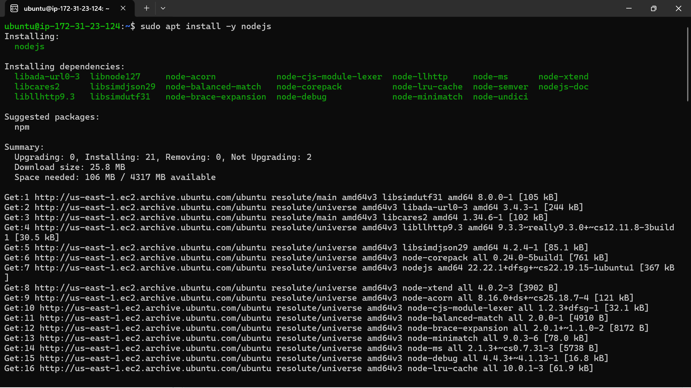
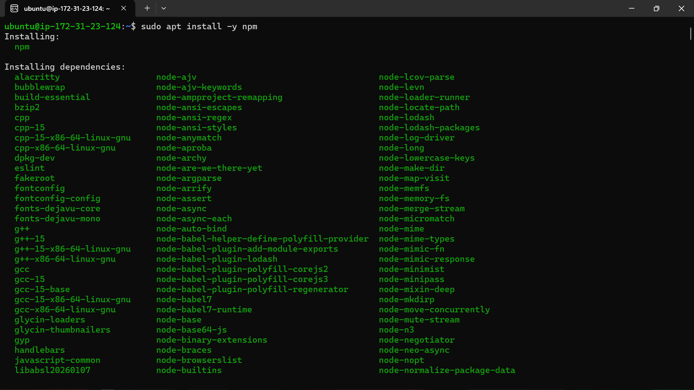
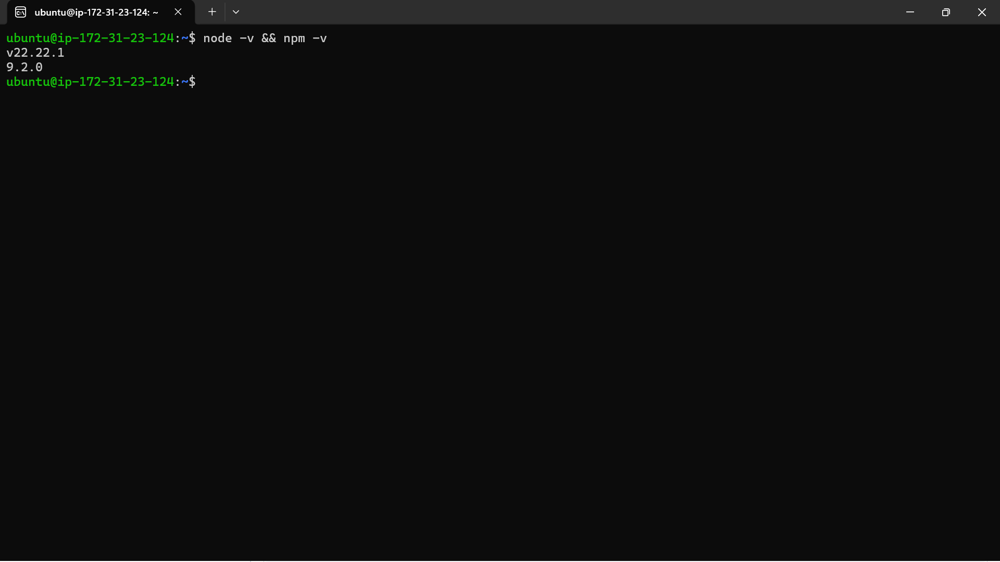

# MEAN Stack Deployment on AWS EC2 (Ubuntu) — Book Register Project

## Overview

I implemented the MEAN stack — MongoDB, Express.js, Angular, and Node.js — on an AWS EC2 Ubuntu instance as part of a guided session at Stack Technology Hub, mentored by Chidi. This project follows on from earlier work I did on the LAMP and LEMP stacks, and continues the series of foundational web stack implementations I've been documenting.

The MEAN stack brings together four JavaScript-based technologies to form a full-stack framework for building and deploying web applications:

- **MongoDB** – a NoSQL document database
- **Express.js** – a backend web application framework for Node.js
- **Angular** – a frontend framework for building dynamic, single-page applications
- **Node.js** – a JavaScript runtime environment for executing server-side code

## Project Scope

For this project, I built a simple **Book Register** application to demonstrate how the four components of the MEAN stack interact. The goal was to:

- Provision and configure an EC2 instance to run a Node.js/Express backend
- Install and run MongoDB locally on the instance (rather than using a cloud-hosted MongoDB Atlas instance, which I had used in a previous project)
- Build a small REST API with Express and Mongoose to manage book records
- Connect a simple Angular-driven frontend to the backend API
- Expose the running application over the correct port through the EC2 security group, and test it in a browser

By completing this project, I gained hands-on experience installing MongoDB from a third-party package repository (including GPG key verification), structuring a Node.js/Express project with separate routes and models directories, wiring up an Angular frontend to consume a backend API, and configuring AWS security group rules to expose an application publicly.

---

## Step 1: Connect to the EC2 Instance via SSH

Log in to your AWS EC2 Ubuntu instance using SSH, referencing your key pair and the instance's public IP address.

```bash
ssh -i "your-key.pem" ubuntu@<your-ec2-public-ip>
```



## Step 2: Update the Package List

Once connected, update the package list to ensure you're working with the latest available package versions.

```bash
sudo apt update -y && sudo apt upgrade -y
```



## Step 3: Add Certificates

Add the required certificates needed for the Node.js installation.

```bash
sudo apt install -y ca-certificates curl gnupg
```



## Step 4: Install Node.js

Install Node.js on the instance.

```bash
sudo apt install -y nodejs
```



## Step 5: Install the npm Package Manager

Install npm, the Node.js package manager.

```bash
sudo apt install -y npm
```



## Step 6: Verify Node.js and npm Versions

Confirm both Node.js and npm installed correctly by checking their versions.

```bash
node -v && npm -v
```



## Step 7: Import the MongoDB GPG Key

Before installing MongoDB from its third-party repository, import the MongoDB GPG key to verify the authenticity of the package.

```bash
curl -fsSL https://pgp.mongodb.com/server-7.0.asc | \
   sudo gpg -o /usr/share/keyrings/mongodb-server-7.0.gpg --dearmor
```


## Step 8: Add the MongoDB Repository

Add the MongoDB package repository to your system's package list.

```bash
echo "deb [ arch=amd64,arm64 signed-by=/usr/share/keyrings/mongodb-server-7.0.gpg ] https://repo.mongodb.org/apt/ubuntu jammy/mongodb-org/7.0 multiverse" | sudo tee /etc/apt/sources.list.d/mongodb-org-7.0.list
```


## Step 9: Update Packages Again

Update the package list again so the newly added MongoDB repository is recognized.

```bash
sudo apt update
```


## Step 10: Install MongoDB

Install MongoDB using the package name `mongodb-org`.

```bash
sudo apt install -y mongodb-org
```


## Step 11: Verify the MongoDB Version

Check that MongoDB installed correctly.

```bash
mongod --version
```


## Step 12: Check and Start the MongoDB Service

Check the status of the MongoDB service.

```bash
sudo systemctl status mongod
```

I noticed that MongoDB showed as **inactive** at this point. Start the service:

```bash
sudo systemctl start mongod
```

Then re-check the status to confirm it's active and running:

```bash
sudo systemctl status mongod
```


## Step 13: Install Body-Parser

Install `body-parser`, a Node.js middleware that parses incoming request bodies (such as JSON or URL-encoded data) into an easily accessible format for the application.

```bash
npm install body-parser
```


## Step 14: Create the Project Directory

Create a new directory to house the project files. This project implements a **Book Register** application.

```bash
mkdir Books
cd Books
```

## Step 15: Initialize the Node Project

Initialize the directory as a Node.js project. This generates a `package.json` file.

```bash
npm init
```

Verify that `package.json` was created:

```bash
ls
```


## Step 16: Create server.js

Inside the `Books` directory, create a new file named `server.js`.

```bash
sudo nano server.js
```

Paste in your server code, then save and exit (`Ctrl+O` to save, `Ctrl+X` to exit).

```javascript
// server.js
// Paste your Express server setup code here (server initialization,
// MongoDB connection, body-parser middleware, and route mounting).
```


## Step 17: Install Express.js

Install Express.js.

```bash
sudo npm install express
```


## Step 18: Install Mongoose

Install Mongoose, an object data modeling (ODM) library for MongoDB and Node.js that provides schema-based data modeling, validation, and querying.

```bash
npm install mongoose
```

I ran into this: a `permission denied` error when running `npm install mongoose`.

**How I fixed it:** The error occurred because the command wasn't run with elevated privileges. Re-running the command with `sudo` resolved it:

```bash
sudo npm install mongoose
```


## Step 19: Create the App Folder

Inside the `Books` directory, create a new folder named `app`, and move into it.

```bash
mkdir app
cd app
```

## Step 20: Create routes.js

Inside the `app` directory, create a new file named `routes.js`.

```bash
sudo nano routes.js
```

Paste in your routes code, then save and exit.

```javascript
// routes.js
// Paste your Express route definitions here (GET, POST, PUT, DELETE
// endpoints for the book register API).
```


## Step 21: Create the Models Folder

Inside the `app` directory, create a new folder named `models`, and move into it.

```bash
mkdir models
cd models
```

## Step 22: Create book.js

Inside the `models` directory, create a new file named `book.js`.

```bash
sudo nano book.js
```

Paste in your Mongoose schema code, then save and exit.

```javascript
// book.js
// Paste your Mongoose schema and model definition for a "Book" here.
```


## Step 23: Create the Public Folder

Navigate back to the project's root directory (`Books`), then create a new folder named `public`.

```bash
cd ~/Books
mkdir public
cd public
```

## Step 24: Create script.js

Inside the `public` folder, create a new file named `script.js`. This file connects the frontend to the Express backend using Angular.

```bash
sudo nano script.js
```

Paste in your AngularJS controller/module code, then save and exit.

```javascript
// script.js
// Paste your AngularJS module and controller code here, including the
// $http calls used to interact with the Express API endpoints.
```


## Step 25: Create index.html

Still inside the `public` folder, create a new file named `index.html`. This file serves as the application's frontend.

```bash
sudo nano index.html
```

Paste in your HTML markup, then save and exit.

```html
<!-- index.html -->
<!-- Paste your HTML markup here, including the AngularJS directives
     (ng-app, ng-controller, ng-repeat, etc.) used to render and manage
     the book register UI. -->
```


## Step 26: Start the Server

Change back to the project's root directory (`Books`) and start the server.

```bash
cd ~/Books
node server.js
```

Confirm the server is up and running, listening on port 3300.


## Step 27: Open Port 3300 in the EC2 Security Group

In the AWS Management Console, open the port for the application:

1. Navigate to your EC2 instance and open the **Security** tab.
2. Scroll down to **Inbound rules** and click on the linked security group.
3. Click **Edit inbound rules**.
4. Add a new rule: **Custom TCP**, port **3300**, with the appropriate source.
5. Click **Save rules**.


## Step 28: Test the Application in the Browser

Copy the public IP address of your EC2 instance, then open it in a browser on port 3300.

```
http://<your-ec2-public-ip>:3300
```


## Step 29: Test the Application's Functionality

Add a new entry (e.g., a book title) through the web application's input form, then reload the page to confirm the entry was saved and persists.


---

## Summary

By completing this project, I implemented the MEAN stack on an AWS Ubuntu EC2 instance and built a working Book Register application. I installed and configured Node.js, npm, and MongoDB (including GPG key verification and repository setup) directly on the instance rather than relying on a cloud-hosted database, structured a Node.js/Express backend with separate `routes` and `models` directories, used Mongoose to model book data, and connected an AngularJS frontend to the Express API. I also configured the EC2 security group to expose the application on port 3300 and verified the application's functionality end-to-end in the browser.

This project deepened my understanding of how the four MEAN stack components — MongoDB, Express.js, Angular, and Node.js — work together, and gave me practical experience troubleshooting real issues (such as the `npm install mongoose` permission error) during a live deployment.

## Appendix: Command Reference

| Command | Purpose |
|---|---|
| `sudo apt update` | Update the local package list |
| `sudo apt install -y nodejs` | Install Node.js |
| `sudo apt install -y npm` | Install the npm package manager |
| `node -v` / `npm -v` | Check installed Node.js / npm versions |
| `curl -fsSL ... \| sudo gpg -o ... --dearmor` | Import the MongoDB GPG key |
| `sudo apt install -y mongodb-org` | Install MongoDB |
| `mongod --version` | Check the installed MongoDB version |
| `sudo systemctl status mongod` | Check the MongoDB service status |
| `sudo systemctl start mongod` | Start the MongoDB service |
| `npm install body-parser` | Install the body-parser middleware |
| `npm init` | Initialize a new Node.js project |
| `sudo npm install express` | Install Express.js |
| `sudo npm install mongoose` | Install Mongoose (requires sudo) |
| `node server.js` | Start the Node.js server |

## Appendix: Ports Reference

| Port | Purpose |
|---|---|
| 22 | SSH access to the EC2 instance |
| 3300 | Book Register application (Node.js/Express server) |
