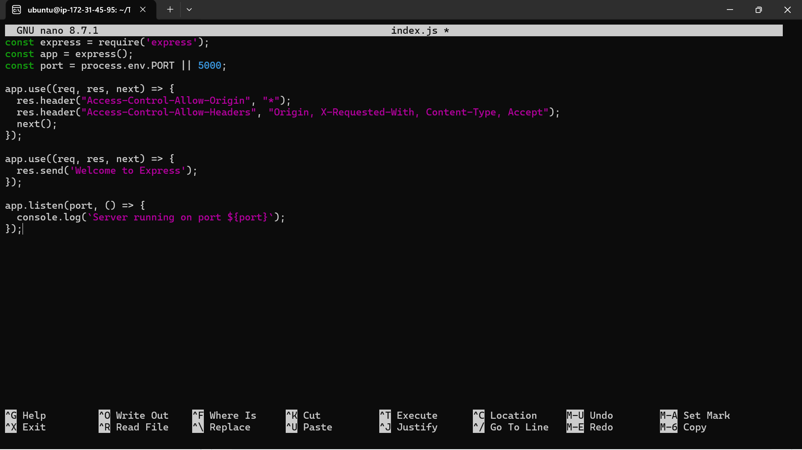
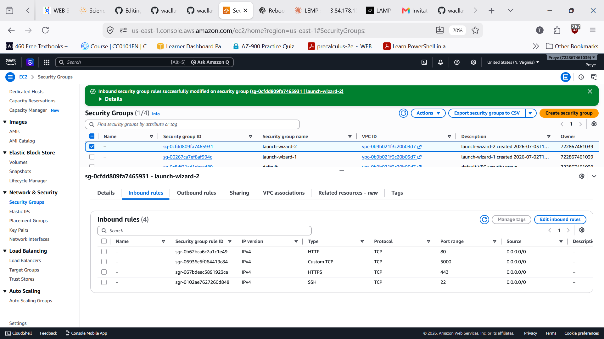
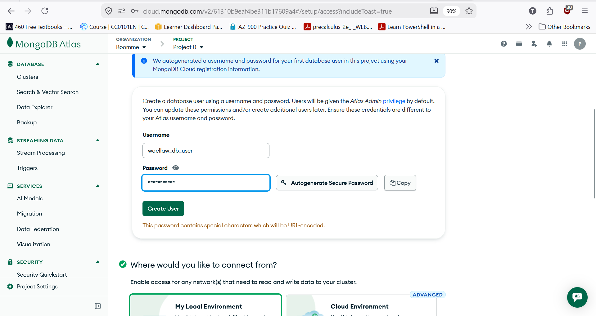
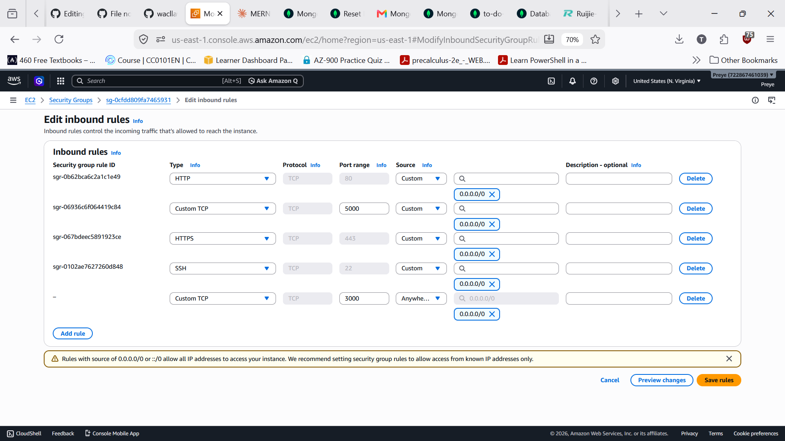
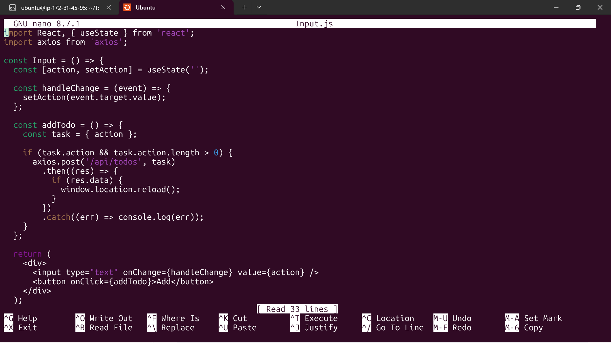
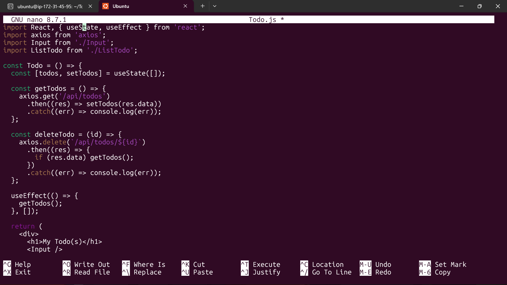
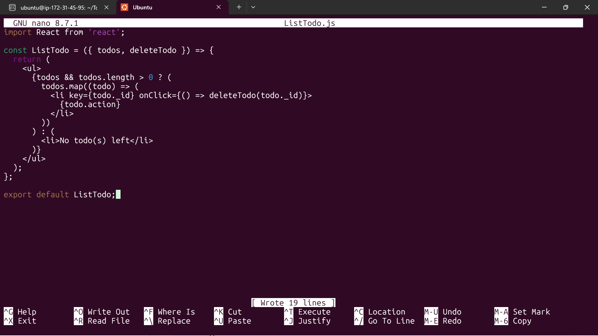
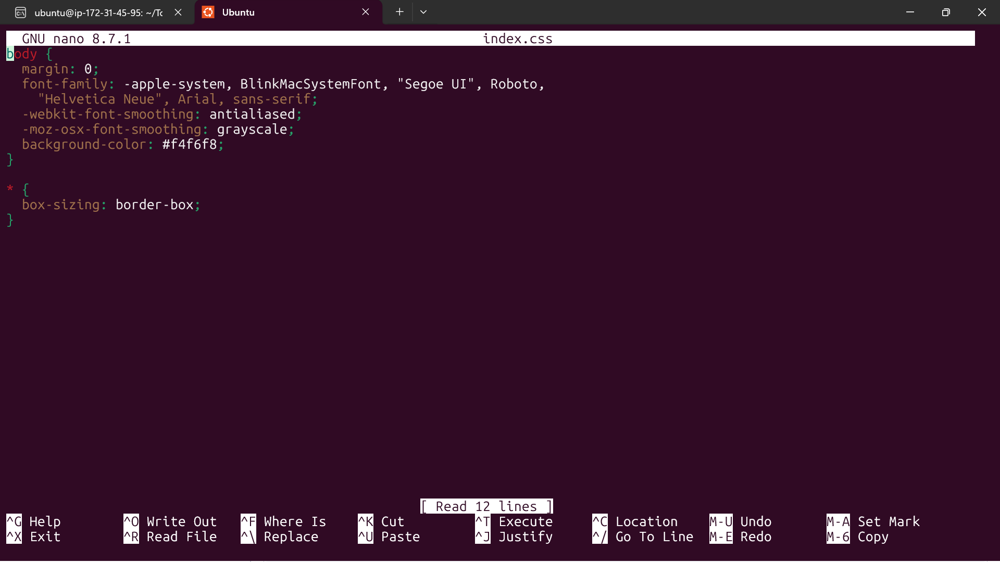
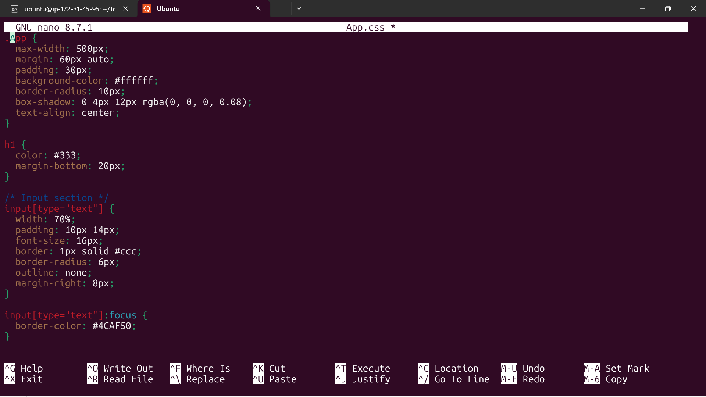

# MERN Stack Implementation: To-Do Application

## Overview

This documentation walks through my implementation of a full-stack **To-Do application** using the **MERN stack**. It covers backend setup, database configuration, API testing, and frontend development, resulting in a complete web application deployed on an AWS EC2 instance.

### What is the MERN Stack?

The MERN stack consists of four core technologies:

| Component | Role |
|---|---|
| **M**ongoDB | A NoSQL database that stores data in JSON-like documents, offering flexibility and scalability for web applications. |
| **E**xpress.js | A web framework for Node.js that provides a robust set of features for building server-side applications and APIs. |
| **R**eact.js | A front-end JavaScript library (developed by Facebook) used to build dynamic, single-page user interfaces without full page reloads. |
| **N**ode.js | A JavaScript runtime built on Chrome's V8 engine, enabling server-side execution of JavaScript for full-stack development in a single language. |

Together, these four technologies form a complete framework for building dynamic web applications.

### Project Scope

I built a simple **To-Do application** that allows users to:
- Create tasks
- View (retrieve) tasks
- Delete tasks

- **Frontend:** React.js
- **Backend:** Node.js + Express.js
- **Database:** MongoDB

The project was divided into two major parts:
1. **Backend configuration** (server, database, API routes)
2. **Frontend configuration** (React UI)

---

## Prerequisites

- An AWS EC2 instance (Ubuntu) with SSH access
- A terminal/SSH client
- A [Postman](https://www.postman.com/) account (for API testing)
- A [MongoDB Atlas](https://www.mongodb.com/atlas) account (referred to as "MLab" in the walkthrough, but the modern equivalent is MongoDB Atlas)

---

## Part 1: Backend Configuration

### Step 1: Connect to the AWS Server

Log in to your EC2 instance via SSH using your key pair, username, and public IP address:

```bash
ssh -i <your-key.pem> <username>@<public-ip-address>
```


### Step 2: Update and Upgrade Ubuntu

Update the package list to ensure you're working with the latest packages:

```bash
sudo apt update
sudo apt upgrade -y
```

### Step 3: Install Node.js

Node.js is required to run the backend server.

```bash
sudo apt install nodejs -y
```

Verify the installation:

```bash
node -v
```


### Step 4: Install NPM

NPM (Node Package Manager) is used to manage project dependencies.

```bash
sudo apt install npm -y
```

Verify the installation:

```bash
npm -v
```


### Step 5: Create the Project Directory

Create a directory for the project and initialize it with NPM:

```bash
mkdir To-Do
cd To-Do
npm init
```

Press **Enter** to accept the default settings (or type a custom project name).


### Step 6: Install Express.js

Express.js provides the server-side framework for the application.

```bash
npm install express
```

### Step 7: Create the Entry File

Create the main server file:

```bash
touch index.js
```

### Step 8: Install the dotenv Module

The `dotenv` module manages environment configuration in a single, centralized file.

```bash
npm install dotenv
```

### Step 9: Configure the Express Server

Open `index.js` and add the server configuration to listen on port `5000`:

```javascript
const express = require('express');
const app = express();
const port = process.env.PORT || 5000;

app.use((req, res, next) => {
  res.header("Access-Control-Allow-Origin", "*");
  res.header("Access-Control-Allow-Headers", "Origin, X-Requested-With, Content-Type, Accept");
  next();
});

app.use((req, res, next) => {
  res.send('Welcome to Express');
});

app.listen(port, () => {
  console.log(`Server running on port ${port}`);
});
```

Start the server:

```bash
node index.js
```

You should see: `Server running on port 5000`




### Step 10: Open Port 5000 in AWS Security Group

To access the server from the browser, open port 5000 in your EC2 instance's security group:

1. Go to the **AWS Management Console** → **EC2** → **Security Groups**.
2. Select the inbound rules for your instance.
3. Click **Add new rule**.
4. Set **Port** to `5000`, **Source** to `Anywhere (0.0.0.0/0)`.
5. Click **Save rules**.




Test it by visiting `http://<public-ip-address>:5000` in your browser. You should see "Welcome to Express."


---

### Step 11: Create Routes

Routes handle the core functionality of the app: creating, retrieving, and deleting tasks.

```bash
mkdir routes
cd routes
touch api.js
```

Open `api.js` and add the route logic:

```javascript
const express = require('express');
const router = express.Router();
const Todo = require('../models/todo');

router.get('/todos', async (req, res, next) => {
  try {
    const data = await Todo.find({});
    res.json(data);
  } catch (err) {
    next(err);
  }
});

router.post('/todos', async (req, res, next) => {
  try {
    if (req.body.action === "") {
      return res.json({ error: "Input field required" });
    }
    const todo = new Todo({ action: req.body.action });
    const data = await todo.save();
    res.json(data);
  } catch (err) {
    next(err);
  }
});

router.delete('/todos/:id', async (req, res, next) => {
  try {
    const data = await Todo.findOneAndDelete({ _id: req.params.id });
    res.json(data);
  } catch (err) {
    next(err);
  }
});

module.exports = router;
```

> **I ran into this: `Model.find() no longer accepts a callback`**
>
> When I first wrote these routes using the older callback style (`Todo.find({}, (err, data) => {...})`), every request failed with a `500 Internal Server Error`. This is because newer versions of Mongoose (6+) removed callback support for queries like `.find()`, `.save()`, and `.findOneAndDelete()` — they only accept Promises now.
>
> **How I fixed it:** I rewrote the route handlers using `async/await` and `try/catch`, as shown in the `api.js` code above. After saving the file and restarting the server with `node index.js`, retrying the request in Postman returned the expected data instead of a 500 error.


### Step 12: Install Mongoose

Since MongoDB is a NoSQL database, we use **Mongoose** to define schemas (blueprints) for our data.

```bash
npm install mongoose
```

### Step 13: Create the Data Model

```bash
mkdir models
cd models
touch todo.js
```

Add the schema definition in `todo.js`:

```javascript
const mongoose = require('mongoose');
const { Schema } = mongoose;

const TodoSchema = new Schema({
  action: {
    type: String,
    required: [true, 'The todo text field is required']
  }
});

const Todo = mongoose.model('todo', TodoSchema);
module.exports = Todo;
```


### Step 14: Update Routes to Use the Model

Return to `routes/api.js` and ensure it references the `Todo` model created above (see Step 11's updated code, which already imports it).

---

### Step 15: Set Up MongoDB Atlas (Database)

1. Go to [MongoDB Atlas](https://www.mongodb.com/atlas) and create an account.
2. Deploy a new cluster, selecting the **free tier**.
3. Name the cluster (e.g., `to-do-db`).
4. Choose **AWS** as the cloud provider and select a region closest to you.
5. Click **Create Cluster**.


#### Create Database Credentials

1. Create a database username and password.
2. Click **Create Database User**.




#### Configure Network Access

1. Go to **Network Access**.
2. Click **Add IP Address**.
3. In the IP address field, enter `0.0.0.0/0` (this allows access from anywhere).
4. Set the temporary access duration (e.g., one week) if prompted.
5. Click **Confirm**/**Save**.


#### Create a Database and Collection

1. Return to the cluster page and click **Browse Collections**.
2. Click **Create Database**.
3. Specify a database name and a collection name.
4. Click **Create**.


#### Get the Connection String

1. Go back to the cluster and click **Connect**.
2. Select **Drivers**, and choose **Node.js** as the driver.
3. Copy the provided connection string.


---

### Step 16: Configure Environment Variables

Create a `.env` file in the project root:

```bash
touch .env
```

Open the file and add the MongoDB connection string, replacing `<password>` with your database user's password:

```
DB = 'mongodb+srv://<username>:<password>@<cluster-url>/<database>?retryWrites=true&w=majority'
```


> **Note:** Storing sensitive configuration (like database credentials) in environment variables rather than hardcoding them is a security best practice.

### Step 17: Update index.js to Use the Environment Configuration

Update `index.js` to connect to MongoDB using Mongoose and the `.env` configuration:

```javascript
const express = require('express');
const bodyParser = require('body-parser');
const mongoose = require('mongoose');
const dotenv = require('dotenv');

dotenv.config();

const app = express();
const port = process.env.PORT || 5000;

// Connect to the database
mongoose.connect(process.env.DB)
  .then(() => console.log('Database connected successfully'))
  .catch(err => console.log(err));

mongoose.Promise = global.Promise;

app.use((req, res, next) => {
  res.header("Access-Control-Allow-Origin", "*");
  res.header("Access-Control-Allow-Headers", "Origin, X-Requested-With, Content-Type, Accept");
  next();
});

app.use(bodyParser.json());

app.use('/api', require('./routes/api'));

app.use((err, req, res, next) => {
  if (err.status) {
    res.status(err.status).json({ message: err.message }).end();
  } else {
    res.status(500).json({ message: err.message }).end();
  }
});

app.listen(port, () => {
  console.log(`Server running on port ${port}`);
});
```

Start the server:

```bash
node index.js
```

You should now see: `Database connected successfully`


> **I ran into this: `MongoParseError: options usenewurlparser, useunifiedtopology are not supported`**
>
> I was using a newer version of the MongoDB Node.js driver (which Mongoose relies on), and it rejected the `useNewUrlParser` and `useUnifiedTopology` options I'd included in my `mongoose.connect()` call. These flags were required in older driver versions but are now default behavior, so recent versions reject them outright instead of ignoring them.
>
> **How I fixed it:** I removed both options from the `mongoose.connect()` call so it looked like this:
>
> ```javascript
> mongoose.connect(process.env.DB)
>   .then(() => console.log('Database connected successfully'))
>   .catch(err => console.log(err));
> ```
>
> After saving `index.js` and running `node index.js` again, the server connected successfully.

> **I ran into this: `MongoServerError: bad auth : authentication failed`**
>
> MongoDB Atlas was rejecting the username/password in my connection string. In my case, and in general, this can come from:
>
> 1. **Special characters in the password** that aren't URL-encoded (e.g., `@`, `#`, `%`, `:`, `/`, `?`, `$`). These must be percent-encoded, or replaced with a simpler alphanumeric-only password.
> 2. **Wrong username or password** — a typo, or the placeholder text wasn't fully replaced.
> 3. **Leftover angle brackets** (`<` `>`) around the actual username/password values in the `.env` file.
> 4. **The database user doesn't exist** for the project/cluster you're connecting to.
>
> **How I fixed it:**
>
> - I went to Atlas → **Database Access** and confirmed the exact username, then reset the password to something alphanumeric only (avoiding encoding issues entirely).
> - I updated the `.env` file with the correct credentials, making sure no `<`, `>`, or extra characters remained:
>
> ```
> DB = 'mongodb+srv://<username>:<password>@<cluster-url>/<database>?retryWrites=true&w=majority'
> ```
>
> - I saved and restarted the server:
>
> ```bash
> node index.js
> ```
>
> This didn't fully resolve it on the first try — see the next two notes for what actually got it working.

> **I ran into this: special characters in the password breaking the connection string**
>
> My database password contained a `$` character, which broke the parsing of the connection string, since characters like `$`, `@`, `#`, `%`, `:`, `/`, and `?` have special meaning inside a URI. This surfaced as the same `bad auth` error above.
>
> **How I fixed it:** I URL-encoded the character in my `.env` file — my password `Test123$` became `Test123%24` (since `$` encodes to `%24`). Common encodings:
>
> | Character | Encoded |
> |---|---|
> | `$` | `%24` |
> | `@` | `%40` |
> | `#` | `%23` |
> | `%` | `%25` |
> | `:` | `%3A` |
> | `/` | `%2F` |
>
> If you'd rather not deal with encoding at all, resetting the database user's password in Atlas → **Database Access** to something alphanumeric only (letters + numbers, no symbols) avoids the issue entirely.

> **I ran into this: `bad auth` persisting even with a correctly encoded password**
>
> After fixing the encoding, I was still getting `bad auth`. It turned out the database user I'd created only had an **Atlas admin** role assigned — which is a project-level/organization role controlling what I could do in the Atlas UI, not a **database role** controlling what the user could do when authenticating from a connection string. Without a proper database role like **Read and write to any database**, authentication fails even with the correct password.
>
> **How I fixed it:** I went to Atlas → **Database Access**, edited the user, and made sure it had **Read and write to any database** assigned under **Database User Privileges**. I also reset the password to something simple and alphanumeric while I was there, waited about a minute for the change to propagate, then restarted the server. That resolved it for good.

---

## Testing the Backend with Postman

Before building the frontend, it's essential to verify the backend works correctly. We'll test three endpoints using **Postman**:

- **GET** `/api/todos` — retrieve all tasks
- **POST** `/api/todos` — create a new task
- **DELETE** `/api/todos/:id` — remove a specific task

### Step 1: Install Postman and Create an Account

Download [Postman](https://www.postman.com/downloads/) and sign in.


### Step 2: Test the GET Request

1. Click the **+** icon to create a new HTTP request.
2. Set the method to `GET`.
3. Enter the URL: `http://<public-ip-address>:5000/api/todos`
4. Click **Send**.

> If the server isn't running, start it with `node index.js` before sending the request.

Since the database is initially empty, you should receive an empty array `[]` as the response.


### Step 3: Test the POST Request

1. Create a new request, set the method to `POST`.
2. Enter the same URL: `http://<public-ip-address>:5000/api/todos`
3. Under **Headers**, add `Content-Type: application/json`.
4. Under **Body**, select **raw** and enter JSON data:

```json
{
  "action": "My first task"
}
```

5. Click **Send**.


To add another task, I reused this same request tab — just updating the JSON body and clicking **Send** again:

```json
{
  "action": "Learning the MERN stack with Stegtech Technology Hub"
}
```

### Step 4: Verify with GET Again

Send the GET request again — you should now see both tasks returned.


### Step 5: Test the DELETE Request

1. Create a new request, set the method to `DELETE`.
2. Copy the `_id` of the task you want to remove from a previous GET response.
3. Enter the URL: `http://<public-ip-address>:5000/api/todos/<task-id>`
4. Click **Send**.


Send a GET request again to confirm the task was removed.


> **Tip:** Attempting a DELETE request without specifying an ID will return an error, since the API needs to know exactly which task to remove.

---

## Part 2: Frontend Configuration

### Step 1: Create the React Application

From the project root directory, scaffold a new React app called `client`:

```bash
npx create-react-app client
```

This installs all necessary React dependencies in one step.


### Step 2: Install Supporting Dependencies

From the **project root** (not inside `client`), install `concurrently` and `nodemon`:

```bash
npm install concurrently --save-dev
npm install nodemon --save-dev
```

- **concurrently** — runs multiple commands (frontend + backend) simultaneously from a single terminal.
- **nodemon** — automatically restarts the server whenever backend code changes.

### Step 3: Update package.json Scripts

Open the root `package.json` and replace the `scripts` section:

```json
"scripts": {
  "start": "node index.js",
  "start-watch": "nodemon index.js",
  "dev": "concurrently \"npm run start-watch\" \"cd client && npm start\""
}
```


### Step 4: Configure the React Proxy

Navigate into the `client` folder and open its `package.json`. Add a `proxy` setting as a top-level key (a sibling to `"name"`, `"version"`, `"dependencies"`, etc.):

```json
"proxy": "http://localhost:5000"
```

**Why this matters:** Since the backend runs on port `5000` and the React frontend runs on port `3000`, the proxy setting allows the frontend to make API calls (e.g., `/api/todos`) without specifying the full backend URL each time. This simplifies development when running both servers on the same machine.


### Step 5: Run Both Servers Concurrently

From the project root:

```bash
npm run dev
```

You should see confirmation that the backend is connected, followed by the React development server starting.


### Step 6: Open Port 3000 in AWS Security Group

Just like port 5000, open port 3000 in your EC2 security group:

1. Go to **Security Groups** → **Inbound Rules**.
2. Add a new rule for port `3000`, source `Anywhere`.
3. Click **Save**.




Visit `http://<public-ip-address>:3000` in your browser to see the default React welcome page — the spinning atom logo confirms the dev server is running correctly.


---

### Step 7: Create React Components

Inside `client/src`, create a `components` directory with three files:

```bash
cd client/src
mkdir components
cd components
touch Input.js ListTodo.js Todo.js
```


#### Input.js

Handles the input field and submission for new tasks:

```javascript
import React, { useState } from 'react';
import axios from 'axios';

const Input = () => {
  const [action, setAction] = useState('');

  const handleChange = (event) => {
    setAction(event.target.value);
  };

  const addTodo = () => {
    const task = { action };

    if (task.action && task.action.length > 0) {
      axios.post('/api/todos', task)
        .then((res) => {
          if (res.data) {
            window.location.reload();
          }
        })
        .catch((err) => console.log(err));
    }
  };

  return (
    <div>
      <input type="text" onChange={handleChange} value={action} />
      <button onClick={addTodo}>Add</button>
    </div>
  );
};

export default Input;
```

#### Step 8: Install Axios

Axios is a promise-based HTTP client used to make requests from React to the backend API. Install it inside the `client` directory, since it's a frontend dependency:

```bash
cd client
npm install axios
```

> Installing a new package like this requires a restart of the dev server (`Ctrl+C` then `npm run dev` from the project root) for the frontend to pick it up.

#### ListTodo.js

Renders the list of tasks and provides deletion functionality:

```javascript
import React from 'react';

const ListTodo = ({ todos, deleteTodo }) => {
  return (
    <ul>
      {todos && todos.length > 0 ? (
        todos.map((todo) => (
          <li key={todo._id} onClick={() => deleteTodo(todo._id)}>
            {todo.action}
          </li>
        ))
      ) : (
        <li>No todo(s) left</li>
      )}
    </ul>
  );
};

export default ListTodo;
```

#### Todo.js

The main component that fetches tasks and combines `Input` and `ListTodo`:

```javascript
import React, { useState, useEffect } from 'react';
import axios from 'axios';
import Input from './Input';
import ListTodo from './ListTodo';

const Todo = () => {
  const [todos, setTodos] = useState([]);

  const getTodos = () => {
    axios.get('/api/todos')
      .then((res) => setTodos(res.data))
      .catch((err) => console.log(err));
  };

  const deleteTodo = (id) => {
    axios.delete(`/api/todos/${id}`)
      .then((res) => {
        if (res.data) getTodos();
      })
      .catch((err) => console.log(err));
  };

  useEffect(() => {
    getTodos();
  }, []);

  return (
    <div>
      <h1>My Todo(s)</h1>
      <Input />
      <ListTodo todos={todos} deleteTodo={deleteTodo} />
    </div>
  );
};

export default Todo;
```





### Step 9: Update App.js

Replace the contents of `client/src/App.js`:

```javascript
import React from 'react';
import Todo from './components/Todo';
import './App.css';

const App = () => {
  return (
    <div className="App">
      <Todo />
    </div>
  );
};

export default App;
```

### Step 10: Update Styling

Replace the contents of `client/src/App.css` and `client/src/index.css` with styling for the to-do list layout. Here's what I used for the input field, button, and list items:

**`client/src/index.css`**

```css
body {
  margin: 0;
  font-family: -apple-system, BlinkMacSystemFont, "Segoe UI", Roboto,
    "Helvetica Neue", Arial, sans-serif;
  -webkit-font-smoothing: antialiased;
  -moz-osx-font-smoothing: grayscale;
  background-color: #f4f6f8;
}

* {
  box-sizing: border-box;
}
```

**`client/src/App.css`**

```css
.App {
  max-width: 500px;
  margin: 60px auto;
  padding: 30px;
  background-color: #ffffff;
  border-radius: 10px;
  box-shadow: 0 4px 12px rgba(0, 0, 0, 0.08);
  text-align: center;
}

h1 {
  color: #333;
  margin-bottom: 20px;
}

/* Input section */
input[type="text"] {
  width: 70%;
  padding: 10px 14px;
  font-size: 16px;
  border: 1px solid #ccc;
  border-radius: 6px;
  outline: none;
  margin-right: 8px;
}

input[type="text"]:focus {
  border-color: #4CAF50;
}

button {
  padding: 10px 18px;
  font-size: 16px;
  background-color: #4CAF50;
  color: #fff;
  border: none;
  border-radius: 6px;
  cursor: pointer;
  transition: background-color 0.2s ease;
}

button:hover {
  background-color: #43a047;
}

/* Todo list */
ul {
  list-style: none;
  padding: 0;
  margin-top: 25px;
  text-align: left;
}

li {
  background-color: #f9f9f9;
  padding: 12px 16px;
  margin-bottom: 8px;
  border-radius: 6px;
  cursor: pointer;
  border-left: 4px solid #4CAF50;
  transition: background-color 0.2s ease, transform 0.1s ease;
}

li:hover {
  background-color: #ffecec;
  border-left-color: #e53935;
  transform: translateX(2px);
}
```

> CSS changes don't require a dev server restart — `npm run dev` will hot-reload automatically.




---

## Running and Testing the Complete Application

From the project root, start both servers:

```bash
npm run dev
```

Open your browser and navigate to `http://<public-ip-address>:3000`.


### Add a Task

Type a task into the input field (e.g., "My first task") and click **Add**. The task should appear in the list immediately.


### Add Multiple Tasks

Continue adding tasks — each one should persist and display in the list.


### Delete a Task

Click on a task to delete it. The list should refresh and no longer display the removed task.


### Verify via Postman

Send a `GET` request to `http://<public-ip-address>:5000/api/todos` to confirm the database reflects the current state of tasks shown in the UI.


---

## Summary

By completing this project, I:

1. Set up a Node.js/Express.js backend server on an AWS EC2 instance.
2. Created RESTful API routes for creating, reading, and deleting tasks.
3. Modeled application data using Mongoose and connected it to a MongoDB Atlas database.
4. Tested all API endpoints using Postman.
5. Built a React frontend that communicates with the backend via a proxy configuration.
6. Deployed and tested a fully functional To-Do application using the complete MERN stack.

Along the way, I ran into and resolved several real-world issues — deprecated Mongoose callback syntax, outdated connection options, authentication failures from unencoded special characters, and an incorrectly scoped database user role — all documented above as troubleshooting notes.

## Next Steps

The next stack I'll be exploring is the **MEAN stack** (MongoDB, Express.js, Angular, Node.js), which replaces React with Angular as the frontend framework.

---

## Appendix: Common Commands Reference

| Task | Command |
|---|---|
| Update packages | `sudo apt update && sudo apt upgrade -y` |
| Install Node.js | `sudo apt install nodejs -y` |
| Install NPM | `sudo apt install npm -y` |
| Initialize project | `npm init` |
| Install Express | `npm install express` |
| Install dotenv | `npm install dotenv` |
| Install Mongoose | `npm install mongoose` |
| Install dev dependencies | `npm install concurrently nodemon --save-dev` |
| Create React app | `npx create-react-app client` |
| Install Axios | `npm install axios` |
| Run both servers | `npm run dev` |
| Start server only | `node index.js` |

## Appendix: Ports Used

| Port | Purpose |
|---|---|
| 5000 | Backend (Express/Node.js API) |
| 3000 | Frontend (React development server) |
